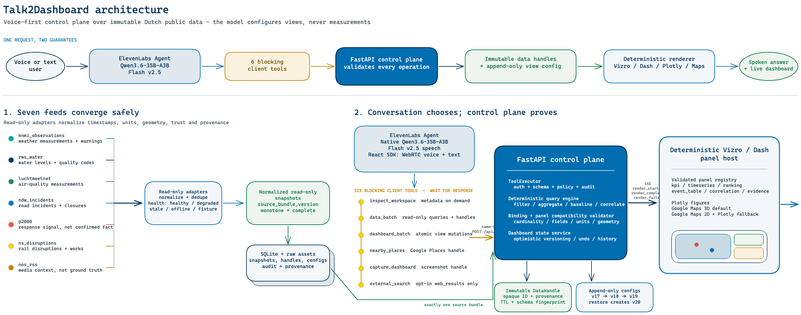
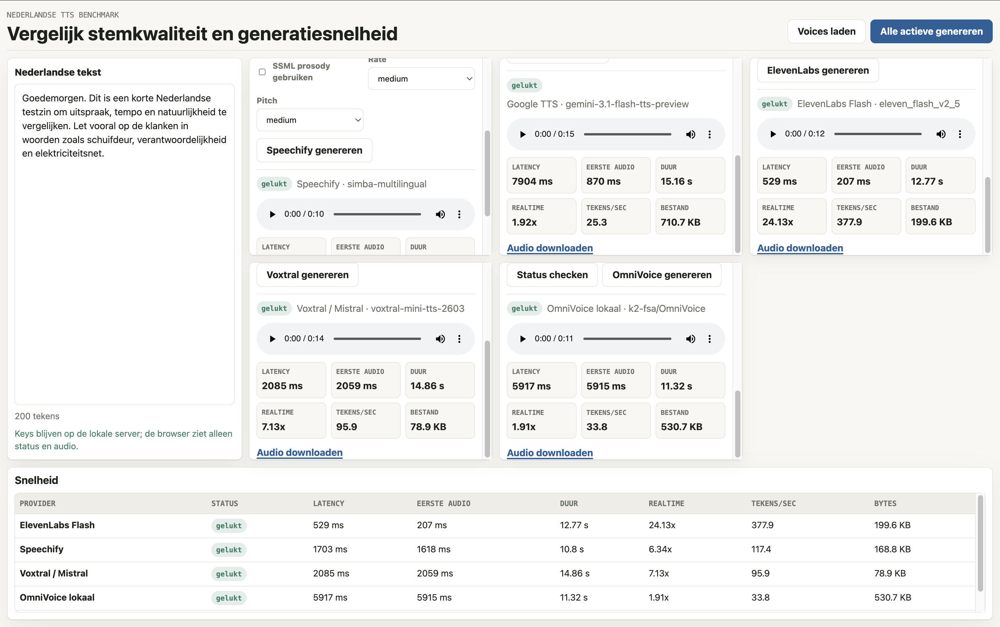
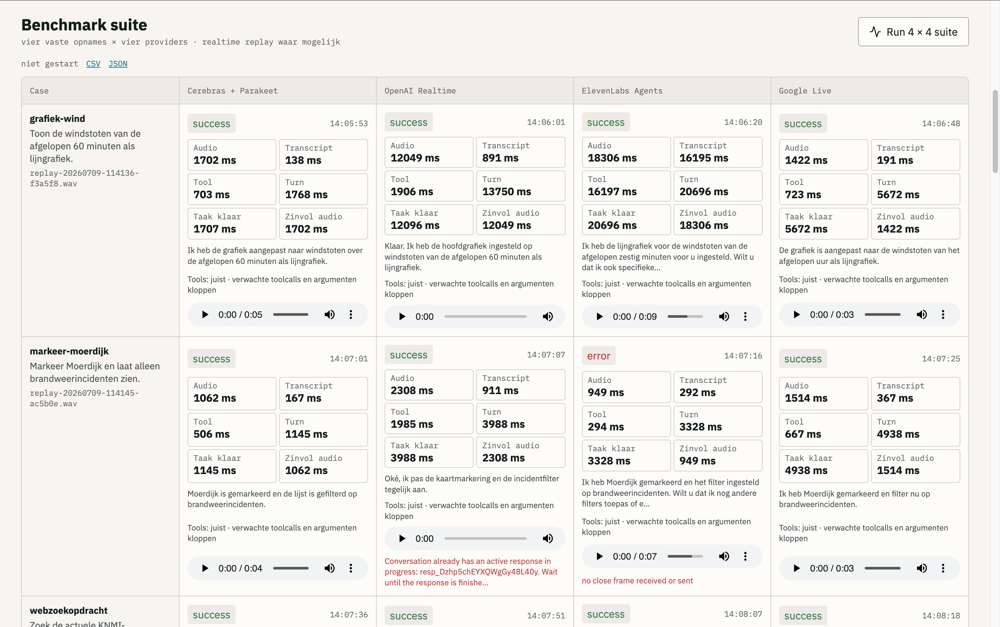
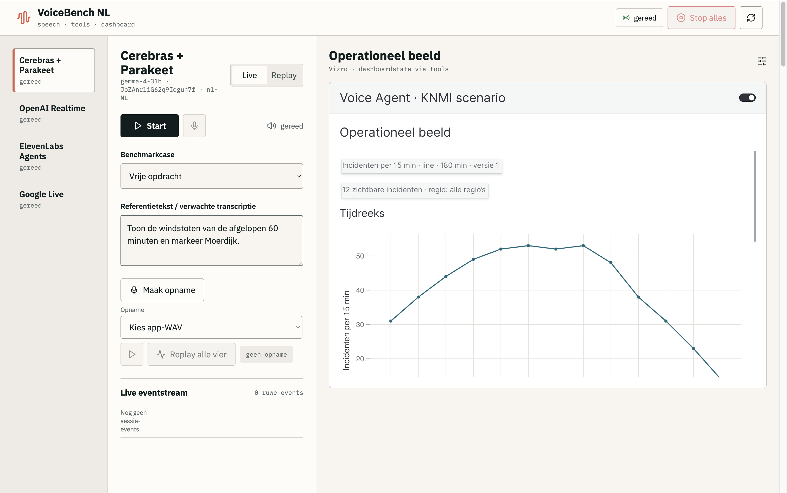
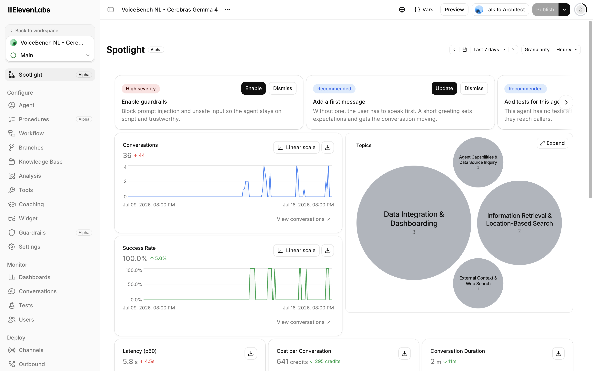
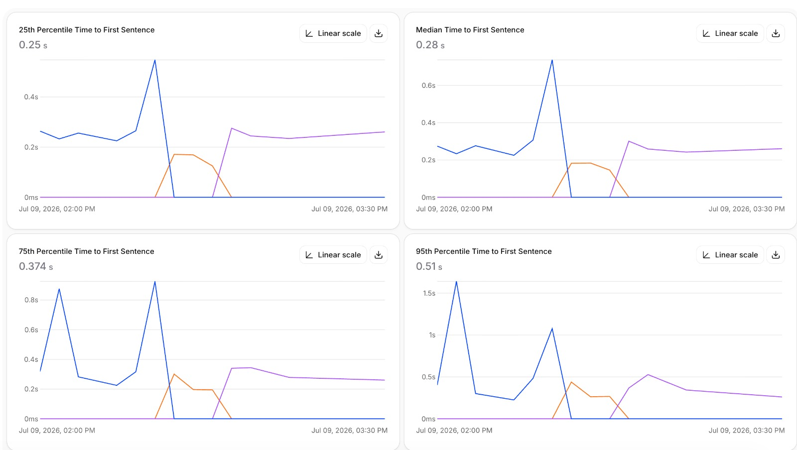

# Talk2Dashboard NL

[Nederlandse versie](README.md)

Talk2Dashboard is a voice-first research demo for querying and restructuring a live operational dashboard in natural Dutch. The agent reads seven Dutch public-data streams, executes bounded tools, and changes only the dashboard configuration. Measurements remain immutable and are processed exclusively by deterministic backend code.



> [Editable Excalidraw source](docs/assets/architecture/talk2dashboard-architecture.excalidraw)

## Demo

The demo starts with a live operational view. A representative request is:

> Focus on this P2000 signal. Within ten kilometres, also show road incidents, KNMI measurements, air-quality stations, water levels and rail disruptions. Put everything on a 3D map and summarise only the most important deviations.

The agent runs read-only queries, receives opaque data handles and can bind panels to those handles. Maps, rankings, time series, KPIs and feeds are rendered by a fixed registry. The agent cannot inject measurements, timestamps, source IDs, colours or arbitrary HTML.

<!-- DEMO_VIDEO_PLACEHOLDER: add docs/assets/video/talk2dashboard-demo.mp4 after recording the product demo. -->

**Demo video:** still to be recorded. The validated walkthrough is documented in [docs/PORTFOLIO_DEMO.md](docs/PORTFOLIO_DEMO.md).

## Why I built this

I have become fascinated by fast language models, especially [Gemma 4 on Cerebras](https://huggingface.co/blog/cerebras-gemma4-voice-ai) and the [Cerebras multimodal demos](https://www.cerebras.ai/blog/first-look-gemma-4-on-cerebras-3-fast-multimodal-apps-we-built). Model discussions focus heavily on quality and cost, but speed is the third side of the same Pareto frontier. In interactive systems, first useful sentence, first tool call and first screen update matter as much as maximum throughput. Latency also compounds across agent and multi-agent workflows.

The [Hugging Voice demo](https://huggingface.co/spaces/HuggingFaceM4/hugging-voice#1-one-line-migration) led to a simple question: what if an operator did not wait thirty minutes for an analysis or dashboard workflow, but built a useful view during the conversation itself?

The [IJmuiden discharge-sluice incident](https://open.rijkswaterstaat.nl/@275817/evaluatie-incident-spuikokers-spui/) made that use case concrete. Fast, source-grounded situational awareness can be valuable in a crisis, especially when public signals are later combined with internal operational data. My exploratory reconstruction is documented in [IJmuiden discharge-sluice incident analysis](docs/IJMUIDEN_INCIDENT_ANALYSIS_EN.md). The conclusion is deliberately narrow: public time series may have exposed an anomalous pattern earlier, but were insufficient for diagnosis or prevention.

## The central design decision

When information matters, the language model should not rewrite or invent the underlying data. The separation is therefore strict:

- adapters fetch and normalise source data;
- snapshots and query results are immutable;
- the backend computes filters, aggregates, correlations and distances;
- the agent receives only handles and configuration tools;
- the renderer accepts only validated panel types and bindings;
- web search is off by default and always labelled as unverified external context.

The dashboard is intentionally bounded. It is neither a general website generator nor an operational decision system. The agent composes an allowed view over existing data.

## Process

### 1. Choosing Dutch TTS

Dutch pronunciation remains a difficult TTS benchmark. I compared cloud and local models on time to first audio, total generation time and subjective intelligibility.

| Route | Benchmark integration | Observation |
| --- | --- | --- |
| ElevenLabs Flash v2.5 | Streaming endpoint | The best latency-quality balance in this demo; Flash sacrifices some expressiveness compared with larger models. |
| Speechify | Streaming endpoint | Usable Dutch output, but first audio arrived later in my runs. |
| Google TTS | `stream: true` | Good control and quality, but slower and more variable in this small test. |
| Voxtral / Mistral | Connected without streaming in my benchmark | [Voxtral TTS does support streaming, Dutch and voice cloning](https://docs.mistral.ai/studio-api/audio/text_to_speech); I have not yet tested a good Dutch clone. |
| OmniVoice | Warm local server, full generation before playback | One of the few local multilingual options that fitted my 16 GB Apple Silicon machine. |



*The TTS experiment primarily exposed the difference in time to first audio. This is one snapshot from my local benchmark, not an independent provider benchmark.*

The local candidates were [OmniVoice](https://huggingface.co/k2-fsa/OmniVoice), [Higgs Audio V2 / Higgs TTS 3](https://huggingface.co/bosonai/higgs-tts-3-4b) and [Fish Audio S2 Pro](https://huggingface.co/fishaudio/s2-pro). OmniVoice was not fast enough for this agent route, but running useful Dutch speech locally on this hardware was impressive.

[Listen to the Dutch OmniVoice sample (MP3)](docs/assets/audio/omnivoice-dutch-sample.mp3)

### 2. Choosing the voice-agent route

I then compared four routes with the same Dutch instructions, dashboard tools and replay audio:

1. local Parakeet V3 STT, Gemma 4 through Cerebras and ElevenLabs Flash v2.5;
2. OpenAI Realtime;
3. ElevenLabs Agents;
4. Google Live.



*The replay suite sent the same recordings to all four routes and captured transcript, tool, audio and total-turn latency.*

OpenAI and Google were native speech-to-speech routes. The Cerebras route was a cascade of STT, LLM and TTS. ElevenLabs Agents orchestrated the conversational pipeline and client tools as a platform service. Parakeet was the fastest useful local Dutch transcription route I tested, but remaining transcription errors mattered for place names and operational terminology.



*Every route received the same dashboard state and tools, making the actual interface change visible alongside speech quality.*

OpenAI still felt unnatural in Dutch in this test. Google Live was promising, but the preview model and live tool loop were occasionally unstable. ElevenLabs combined good voices with a mature agent dashboard, session lifecycle and extensive configuration. I ultimately selected a native, non-reasoning ElevenLabs `Qwen3.6-35B-A3B` rather than calling Cerebras externally for every response: in my small test, tool use remained good enough and time to first sentence was lowest.

For short spoken responses, TTFT/TTFS matters more than maximum tokens per second. This was an exploratory comparison, not a statistically rigorous model benchmark. See the broader [Artificial Analysis comparison](https://artificialanalysis.ai/models/gemini-3-pro?models=qwen3-6-35b-a3b%2Cqwen3-6-35b-a3b-non-reasoning%2Cqwen3-5-397b-a17b%2Cqwen3-5-397b-a17b-non-reasoning%2Cgemma-4-31b-non-reasoning%2Cgemma-4-31b).



*The platform layer also exposed conversations, topics, latency and failed tool calls.*



*In this small model experiment, blue represented Gemma 4 through Cerebras, yellow Qwen 35B and purple Qwen 397B. Qwen 35B offered the strongest combination of first-sentence latency and usable tool calling here.*

The separate TTS and voice-agent comparison applications are not included in this repository, but their code is available on request.

### 3. Choosing a dashboard renderer

I tried Gradio, Tremor, Vizro and Taipy. Vizro won on implementation speed, its small component surface and straightforward Plotly integration. This also limited what the agent needed to understand.

The choice has drawbacks: the standard components and responsive layout are less refined than a fully custom frontend. The demo therefore evolved towards a controlled Dash/Vizro panel host, a custom Control Room visual language and a fixed panel registry. I would reassess the renderer in a next version.

### 4. Bounding public data and tools

The sources are a pragmatic and somewhat arbitrary cross-section of Dutch public operational data. They demonstrate the pattern; internal data would make the system organisation-specific.

| Stream | Source | Role in the demo |
| --- | --- | --- |
| `p2000` | 112Radar REST with Alarmeringen RSS fallback | Emergency-service signal; never treated as a confirmed incident by itself. |
| `knmi_observations` | [KNMI Open Data](https://developer.dataplatform.knmi.nl/) | Weather observations, warnings, wind and precipitation. |
| `rws_water` | [Rijkswaterstaat Waterdata](https://waterinfo.rws.nl/) | Water levels and measurement-point context. |
| `ndw_incidents` | [NDW DATEX II](https://opendata.ndw.nu/) | Road incidents, closures and traffic measures. |
| `luchtmeetnet` | [Luchtmeetnet Open API](https://api-docs.luchtmeetnet.nl/) | Air Quality Index, particulate matter, nitrogen dioxide and ozone per station. |
| `ns_disruptions` | [NS Travel Information API](https://apiportal.ns.nl/) | Current disruptions and planned engineering works. |
| `nos_rss` | [NOS RSS](https://feeds.nos.nl/nosnieuwsalgemeen) | News context, not operational ground truth. |

Google Maps 2D/3D, Geocoding and Places provide visualisation and temporary surroundings context only. The [Google Maps 3D view](https://mapsplatform.google.com/maps-products/3d-maps/) was an important visual inspiration.

The agent has six broad tools:

| Tool | Allowed behaviour |
| --- | --- |
| `inspect_workspace` | Inspect sources, health, schemas, panel types and dashboard state when genuinely needed. |
| `data_batch` | Run multiple read-only queries, aggregates, baselines, correlations and radius queries in one call. |
| `dashboard_batch` | Change panels, layout, filters and metadata atomically; never write source values. |
| `nearby_places` | Search bounded Google Places types around a validated source location. |
| `capture_dashboard` | Capture a reproducible screenshot and structured state for one dashboard version. |
| `external_search` | Retrieve current web results as unverified context, only after explicit opt-in. |

Panels are equally bounded: feeds, events, KPIs, rankings, time series, comparisons, correlations, 2D/3D maps, Places, source health, evidence and a clearly labelled AI summary. One panel can bind at most six validated sources; a dashboard can show at most twelve operational panels.

## What I hope this demonstrates

Voice is not merely a chat layer on top of a dashboard. With fast models and small, carefully designed tools, a conversation can reshape the interface while deterministic systems retain control over data integrity. This project is intended as inspiration for real-time analytics and crisis context, not as a claim that it is already a production-ready government dashboard.

## Inspiration and credits

- [Reson8](https://console.reson8.dev/custom-models), an interesting Dutch voice company whose custom-model route I would like to explore.
- [Hex](https://hex.tech/), which has made analytics and dashboarding considerably more productive and enjoyable. I am curious what its time-to-dashboard could become with models such as Gemma 4 on Cerebras.
- [Thinking Machines: Interaction Models](https://thinkingmachines.ai/blog/interaction-models/), a strong perspective on interfaces that form around user intent.
- [World Monitor](https://www.worldmonitor.app/dashboard), an impressive public-information project far beyond this demo in scale and polish.
- [Hugging Face speech-to-speech](https://huggingface.co/blog/cerebras-gemma4-voice-ai) and [Cerebras](https://www.cerebras.ai/blog/first-look-gemma-4-on-cerebras-3-fast-multimodal-apps-we-built) for the original latency inspiration.

## Limitations and future work

- The product-demo MP4 still needs to be recorded.
- Reliable platform-level parallel tool calls depend on the selected agent model; independent operations within `data_batch` already run concurrently.
- Tool use during continuous speech and true full-duplex interaction should be retested with [GPT-Live](https://openai.com/index/introducing-gpt-live/) and later Gemini Live generations.
- Dutch STT remains vulnerable to addresses, abbreviations and place names.
- The tool catalogue is intentionally small but will not scale indefinitely; a next version could use specialist subagents or a capability router.
- The UI and panel renderer could move towards a fully custom frontend.
- History is accumulated locally and capped at two days in v1. A fresh installation cannot recreate past snapshots retroactively.
- Public sources have latency, outages, gaps and different trust levels. P2000 is not a general official government feed.
- Automated triggers on news, P2000 signals or water thresholds are interesting future work but require careful false-positive analysis. See the [IJmuiden analysis](docs/IJMUIDEN_INCIDENT_ANALYSIS_EN.md).
- More sources would move the system towards World Monitor, but also demand stricter source selection and information architecture.
- Production use requires authentication, secret management, observability, rate limiting, privacy review, operational governance and integration with internal systems.

<details>
<summary><strong>Run the demo locally</strong></summary>

This project is a local single-user research demo.

```bash
git clone https://github.com/Nathan-Jonker/talk2dashboard.git
cd talk2dashboard
make install
make capture-install
cp .env.example .env
```

Minimum voice configuration:

```dotenv
ELEVENLABS_API_KEY=
ELEVENLABS_AGENT_ID=agent_3301kx2t5vbbfsbaezy059s1e8t8
```

Optional maps and enrichment:

```dotenv
GOOGLE_MAPS_BROWSER_API_KEY=
GOOGLE_MAP_ID=
GOOGLE_PLACES_SERVER_API_KEY=
GOOGLE_GEOCODING_SERVER_API_KEY=
CEREBRAS_API_KEY=
```

Synchronise only when you intend to update the ElevenLabs agent configuration:

```bash
make agent-check
make agent-sync
```

Start the application:

```bash
make dev
```

Open `http://127.0.0.1:8002/`. For a keyless deterministic environment:

```bash
make fixture
```

Quality checks:

```bash
make smoke
make quality
```

See `.env.example`, `TECH_SPEC.md` and `docs/PORTFOLIO_DEMO.md` for full configuration and the validated scenario.

</details>

Codex was the Agentic engineering driver
