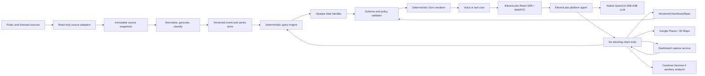

# Talk2Dashboard NL - Technical Specification

## Documentstatus

- Status: build-ready specification
- Datum: 10 juli 2026
- Doel: overdraagbare technische grondslag voor een nieuw, publiek GitHub-project
- Taal van de applicatie: Nederlands (`nl-NL`)
- Taal van publieke README, code, comments, tests en module-/tool-IDs: Engels
- Primaire interface: desktop-first responsive webapp
- Primaire gebruiker: operationeel analist, crisiscoordinator of onderzoeker die publieke Nederlandse datastromen via spraak of tekst onderzoekt

## Overview

Talk2Dashboard NL is een voice-first operationeel dashboard waarin een gebruiker in natuurlijk Nederlands vragen stelt over live Nederlandse publieke datastromen. Een ElevenLabs Agent voert compacte, gevalideerde tools uit om data te bevragen, panelen te configureren, kaartcontext op te halen en het dashboard te analyseren. Vizro rendert uitsluitend toegestane componenten in een vaste huisstijl.

De agent mag nooit observaties, meetwaarden, incidenten, coordinaten of bronverwijzingen schrijven of wijzigen. Alle zichtbare brondata komt uit onveranderlijke, versioned datahandles. De agent verandert alleen een gevalideerde `DashboardSpec`: de keuze, ordening, visualisatie en filtering van reeds beschikbare data.

## Goals

- Binnen enkele seconden een passend operationeel dashboard samenstellen uit meerdere bronfamilies.
- Dezelfde actieve ElevenLabs-conversatie ondersteunen via microfoon en tekstchat.
- Elke grafiek, kaart, tabel, KPI en uitgesproken feit herleidbaar maken naar bronrecords.
- De agent veel presentatieflexibiliteit geven zonder vrije HTML, CSS, JavaScript, SQL of inline data toe te staan.
- Het aantal toolcalls en het aantal geretourneerde tokens minimaliseren zonder controleerbaarheid te verliezen.
- Een professioneel GitHub-project opleveren met begrijpelijke modulegrenzen, live bronadapters, auditlogs en reproduceerbare tests.
- Live data via een genormaliseerd contract verwerken; replay is alleen een ontwikkel- en evaluatieharnas.
- Een volledige dashboardscreenshot kunnen maken en, waar nodig, door Cerebras Gemma 4 laten analyseren.

## Non-goals

- Geen meldkamer-, alarmerings- of crisisbeslissingssysteem voor productiegebruik.
- Geen vervanging voor GMS, LCMS, NL-Alert, Waterinfo, NDW of andere operationele bronsystemen.
- Geen dispatching, alarmering, routeadvies of automatische inzetbeslissingen.
- Geen mutaties terugschrijven naar bronsystemen.
- Geen persoonsgegevens, pagercodes, telefoonnummers of herleidbare melderinformatie tonen.
- Geen willekeurige webpagina's automatisch verheffen tot operationele waarheid.
- Geen vrije generatieve UI-code of door het model gekozen CSS.
- Geen gegarandeerde live P2000-dekking vanuit een officiele overheids-API; die bestaat publiek niet als algemene API.
- Geen HTML-scraping als er een API, RSS-feed of gedocumenteerde export bestaat.

## Assumptions

- V1 is een lokale single-user onderzoeksdemo zonder accountlogin.
- De repository bevat uitsluitend voorbeeldconfiguratie, tests en geredigeerde fixtures; nooit API-keys of productiedata met persoonsgegevens.
- De bestaande ElevenLabs Agent `agent_3301kx2t5vbbfsbaezy059s1e8t8` wordt hergebruikt, tenzij een implementatie-issue expliciet een nieuwe agent kiest.
- De ElevenLabs Agent gebruikt voice `SXBL9NbvTrjsJQYay2kT`, Nederlands als expliciete standaardtaal, ElevenLabs Flash v2.5 voor spraak en het native ElevenLabs LLM-model `Qwen3.6-35B-A3B`.
- Tool-calling van `Qwen3.6-35B-A3B` op de geneste batch-schema's met `@alias`-referenties is al gevalideerd met een handmatige smoke test; hiervoor is geen aparte validatiestap in de implementatievolgorde nodig.
- Cerebras Gemma 4 wordt alleen gebruikt voor niet-voice-agent LLM-calls zoals initial planning, screenshotanalyse, offline evaluatie en eventuele backend redenering buiten de ElevenLabs-turn.
- Websearch staat standaard uit en is een sessiebeleid, niet alleen een cosmetische UI-toggle.
- Google Maps, Google Maps 3D en Places zijn de primaire kaart- en POI-route voor de portfolio-demo; Google Geocoding is alleen een tijdelijke resolver en Place ID route, geen duurzame brongeometrie.
- PDOK is optioneel en standaard uit; het blijft nuttig voor officiele Nederlandse referentielagen, maar blokkeert de MVP niet.

## Portfolio scenario

### Hoofdscenario: cross-source incidentbeeld

Een operationeel analist krijgt een nieuwe P2000-achtige melding rond een Nederlandse locatie. De gebruiker vraagt de agent om:

1. de melding en gerelateerde incidenten te tonen;
2. de locatie te koppelen aan weer, water, verkeer, luchtkwaliteit, spoorverstoringen en nieuwscontext;
3. alleen relevante panelen te tonen;
4. nabijgelegen objecten zoals scholen, ziekenhuizen en tankstations binnen maximaal vijf kilometer te zoeken;
5. bronzekerheid en actualiteit zichtbaar te houden;
6. mondeling antwoord te geven zonder andere waarden te noemen dan de datahandles bevatten.

De standaard livecase gebruikt het meest recente veilige incident- of broncluster dat de adapters kunnen ophalen. Voor demo's zonder keys en CI-tests bestaan geredigeerde fixtures, nadrukkelijk gelabeld als synthetisch of recorded snapshot.

### Voorbeeldinteracties

- "Bouw een operationeel beeld rond deze melding en toon alleen bronnen van het afgelopen uur."
- "Welke scholen en ziekenhuizen liggen binnen vijf kilometer van dit incident?"
- "Vergelijk de windstoten met normaal en zet de afwijking bovenaan."
- "Laat zien of weg- en spoorverstoringen in hetzelfde gebied vallen."
- "Maak de kaart driedimensionaal en focus op het incident en de dichtstbijzijnde kwetsbare objecten."
- "Verberg NOS-context en toon alleen operationele bronnen."
- "Wat is sinds de vorige update veranderd?"
- "Maak een screenshot en controleer of het dashboard de belangrijkste bron en onzekerheid duidelijk toont."
- "Zet websearch aan" mag niet door de agent zelf worden uitgevoerd. Alleen de gebruiker kan de toggle in de UI wijzigen.

## User stories

- De gebruiker start een gesprek, ziet direct een rustige audiovisualisatie en spreekt een vraag in. Partiele transcriptie verschijnt tijdens het spreken; de definitieve transcriptie vervangt de voorlopige tekst zonder duplicaten.
- De gebruiker typt een opdracht in dezelfde conversatie. De agent behoudt dezelfde dashboardcontext en gebruikt `sendUserMessage`; een aparte chatagent is niet nodig.
- De gebruiker vraagt een feitelijke vraag. De agent inspecteert of bevraagt datahandles, noemt de bron en actualiteit en spreekt alleen waarden uit die in toolresultaten aanwezig zijn.
- De gebruiker vraagt een dashboardwijziging. De agent voert normaal maximaal een data-batch en een dashboard-batch uit. De update verschijnt atomair zonder paginareload.
- De gebruiker opent het infomenu en ziet welke streams, velden, periodes, bronstatussen, paneltypes en toegestane aanpassingen beschikbaar zijn.
- De gebruiker schakelt websearch bewust in. De UI toont een blijvende waarschuwing dat webresultaten niet operationeel bevestigd zijn. Uitschakelen blokkeert nieuwe externe zoekopdrachten onmiddellijk.
- De gebruiker stopt de sessie. Microfoon, WebRTC-verbinding, timers en pending toolcalls worden afgesloten; `pagehide` en `beforeunload` voeren dezelfde cleanup uit.
- De gebruiker kan de laatste dashboardwijziging ongedaan maken zonder data of eerdere bronversies te verwijderen.

## Interface and navigation

### 1. Operational workspace

Dit is het eerste en primaire scherm; er is geen marketinglandingpage.

De vaste shell bevat:

- compacte topbar met projectnaam, live bronstatus, laatste update, infoknop en instellingen;
- responsieve Vizro-dashboardruimte met operationele panelen;
- een vaste conversation dock onderaan of aan de rechterzijde;
- een compacte activity rail met de actuele agentstatus en laatste toolactie;
- een websearch-toggle in instellingen, standaard uit;
- een developer/evaluation menu met recorded snapshots, niet als primaire gebruikersmodus.

### Why fixtures/evaluation still exist

De normale applicatie is live-first. Fixtures en recorded snapshots bestaan alleen voor:

- CI-tests en regressietests zonder externe keys;
- reproduceerbare GitHub-demo's wanneer er net geen relevant incident of storing live is;
- visuele tests van dashboardconfiguraties;
- bewijs dat toolcalls dezelfde dashboardstate opleveren bij dezelfde input.

De UI mag nooit stilzwijgend van live data naar fixturedata overschakelen. Als een live bron ontbreekt, toont de app source health en disabled states.

### 2. Conversation dock

De dock bevat:

- start/stop-knop;
- mute-knop;
- audio-outputindicator;
- geanimeerde voice orb;
- gestreamde user- en agenttranscriptie;
- tekstinvoer en verzendknop;
- statuslabels: `offline`, `verbinden`, `luisteren`, `denken`, `tool uitvoeren`, `spreken`, `fout`;
- expliciete `Stop alles`-actie die conversation, audio, pending requests en bronupdates stopt.

De voice orb reageert op echte input- en outputfrequentiedata. Hij verandert niet willekeurig van formaat en veroorzaakt geen layout shift. Visuele toestanden:

- idle: dunne RWS-blauwe ring;
- listening: zachte pulserende cyan ring op basis van inputvolume;
- thinking: rustige roterende segments;
- tool: korte lopende progressring met toolnaam ernaast;
- speaking: waveform/ring op basis van outputfrequenties;
- error: stilstaande rode rand, nooit continu knipperend.

### 3. Data and capabilities menu

Een zijpaneel toont:

- streams met naam, eigenaar, trust tier, laatst ontvangen record, verwachte updatefrequentie en status;
- voor iedere stream de bevraagbare velden en ondersteunde aggregaties;
- beschikbare paneltypes en ondersteunde bindings;
- wat de agent wel kan aanpassen: layout, filters, selectie, kaartfocus, paneltype, titel en databinding;
- wat de agent niet kan aanpassen: bronrecords, numerieke waarden, source IDs, timestamps, units, quality flags en huisstijl;
- websearchbeleid en de reden dat het standaard uit staat;
- actieve dashboardversie en source bundle-versie.

### 4. Source and evidence drawer

Klikken op een bronbadge, datapunt of tabelregel opent:

- bronorganisatie en URL;
- oorspronkelijk record-ID;
- observed-at en ingested-at;
- kwaliteitsstatus en trust tier;
- eventuele normalisatie- of geocodingstappen;
- alle panelen en gesproken claims die naar dit record verwijzen.

### 5. Evaluation and diagnostics view

Deze developer-only view toont:

- geredigeerde recorded snapshots en fixtures;
- verwachte tools en dashboarduitkomst;
- latency van verbinding, transcript, eerste tool, dashboard-commit, eerste audio en turn-completion;
- toolcalls en compacte resultaten;
- source fidelity en verboden claims;
- screenshot voor en na de wijziging;
- audio en transcriptie van de test-run.

## Visual design contract

De visuele richting combineert rustige Apple-achtige productinteractie met herkenbare Nederlandse overheids-/Rijkswaterstaataccenten.

### Fixed design tokens

- achtergrond: gebroken wit/lichtgrijs, niet beige;
- primair: Rijkswaterstaat-achtig blauw;
- secundair: helder cyan/teal voor live data;
- tekst: bijna zwart en koel donkergrijs;
- waarschuwing: geel/oranje;
- kritisch: rood, uitsluitend voor echte fout- of kritieke status;
- kaarten en grafieken gebruiken meerdere functionele kleuren, geen eenkleurig blauw dashboard;
- systeemfontstack met `-apple-system`, `BlinkMacSystemFont`, `Segoe UI`, sans-serif;
- letter spacing altijd nul;
- compacte paneeltitels, geen hero-typografie in dashboardpanelen;
- cardradius maximaal acht pixels;
- duidelijke focusring en minimaal WCAG AA-contrast;
- iconen uit een consistente iconset; geen handgetekende SVG's waar een standaardicoon bestaat.

### Renderer ownership

De agent kiest uitsluitend:

- een layouttemplate;
- paneltype;
- panelvolgorde en een semantische span (`compact`, `standard`, `wide`, `full`);
- logical data binding en veldbindings;
- toegestane grafiekencoding;
- displaytitel en operationele focus.

Vizro en de panelregistry bepalen:

- exacte grid/flexregels;
- afmetingen, spacing, typografie, kleuren en responsiviteit;
- toegestane assen, legends, hovertemplates en formattering;
- loading, empty, stale en error states;
- kaartcontrols en cameragrenzen.

Vrije CSS, HTML, JavaScript, Dash callbackcode of Plotly JSON vanuit de agent wordt geweigerd.

## Architecture



### Component boundaries

1. Source adapters own authentication, polling/push, parsing, retries and source-specific schemas.
2. Normalization owns timestamps, units, locations, trust tiers, quality flags and deduplication.
3. Query engine owns filters, aggregates, baselines, correlations and incident clustering.
4. Handle store owns immutable query results, TTL, provenance and schema fingerprints.
5. Tool executor owns authorization, validation, token budgets, auditlogging and concurrency.
6. Dashboard state service owns `DashboardSpec`, optimistic concurrency, undo and version history.
7. Vizro renderer owns the component registry and all visual output.
8. Voice shell owns ElevenLabs session lifecycle, streaming transcript, orb and text chat.
9. ElevenLabs platform agent owns the speech session and native Qwen LLM reasoning.
10. Cerebras services own auxiliary Gemma 4 requests for startup planning, screenshot analysis and offline/evaluation work.

## Immutable data contract

### Core invariant

No tool accepts inline observations or arbitrary values for a data series. A dashboard panel can only bind to a validated logical data binding that materializes to server-issued immutable handles at render time.

Valid:

```json
{
  "panel_id": "wind-baseline",
  "panel_type": "timeseries",
  "binding": {
    "binding_id": "bnd_01J...",
    "kind": "series",
    "query_hash": "qry_01J...",
    "query_spec": {
      "stream": "knmi_observations",
      "metric": "wind_gust_kmh",
      "window": "PT60M"
    },
    "field_bindings": {
      "x": "observed_at",
      "y": "wind_gust_kmh"
    },
    "refresh_policy": "visible"
  }
}
```

Invalid and rejected:

```json
{
  "values": [12, 18, 42],
  "coordinates": [51.7, 4.6],
  "plotly": {"data": []}
}
```

### Allowed agent-authored content

- paneltitel;
- korte AI-samenvatting;
- gekozen layout en paneltype;
- veldnamen die door het handle-schema zijn toegestaan;
- filterexpressies uit de beperkte filter-DSL.

Agent-authored tekst krijgt altijd het label `AI-samenvatting`. Numerieke of feitelijke uitspraken in die tekst moeten bronreferenties bevatten. De validator controleert dat genoemde numerieke literals voorkomen in de gebruikte toolresultaten; bij twijfel wordt de tekst niet als datapanel gerenderd.

## Data sources and adapters

| Stream | Gebruik | Access | Default cadence | Trust treatment |
|---|---|---|---|---|
| P2000 | Eerste incidenttrigger en discipline/urgentiecontext | Geen algemene officiele publieke overheids-API. V1 gebruikt 112Radar WebSocket/REST als primaire live adapter wanneer key aanwezig is; Alarmeringen RSS als keyless fallback | WebSocket push of korte RSS-poll | `signal`, nooit zelfstandig bevestigd feit |
| KNMI | Waarschuwingen, tienminutenmetingen, wind, neerslag, radar/nowcast | KNMI Open Data/EDR en Notification Service met API-key | Push waar mogelijk; niet agressief pollen | `official_measurement` of `official_warning` |
| RWS Waterdata | Waterhoogte, afvoer, verwachtingen en kwaliteitscodes | Nieuwe `ddapi20` Waterwebservices | Volgens meetfrequentie, meestal minuten | `official_measurement`; status gecontroleerd/ongecontroleerd bewaren |
| NDW | Wegincidenten, obstructies, files en werkzaamheden | Open DATEX II-stream; incident snapshot wordt ongeveer per minuut vernieuwd | Een minuut | `official_operational_feed` |
| Luchtmeetnet | LKI, PM10, PM2.5, NO2, O3 en stations | Publieke OpenAPI zonder authenticatie | Uurlijkse broncadans | `official_measurement`; geen realtime rookpluimclaim afleiden |
| NS storingen | Storingen, werkzaamheden en stationscontext | NS API Portal product `NS App API`, Reisinformatie API endpoint `/reisinformatie-api/api/v3/disruptions` met subscription key | Dertig tot zestig seconden, binnen limieten | `official_operational_feed` |
| NOS RSS | Publieke nieuwscontext en mogelijke bevestigingszoekrichting | Officiele NOS RSS-feeds | Twee tot vijf minuten | `media_context`; nooit operationele grondwaarheid |
| Google Maps/Geocoding | Kaartweergave, camera en 3D-context; geocoding alleen voor tijdelijke locatie-resolutie of Place ID lookup | Maps JavaScript API, Map Tiles/3D waar nodig en Geocoding API met beperkte keys | Kaart live; geocoding on demand; geen permanente opslag van Google-geometrie buiten toegestane uitzonderingen | `commercial_reference`; bronlabel verplicht |
| Google Places | Scholen, ziekenhuizen, tankstations en andere POI's rond een bestaande locatiehandle | Places API Nearby Search (New), billed API-key | Alleen on demand | `commercial_reference`; bronlabel verplicht |
| PDOK | Optionele Nederlandse referentielaag voor bestuurlijke grenzen, BAG/BGT/AHN-achtige context en officiele geometrie | Publieke OGC/Locatieserverdiensten | Cachen; statische context | `official_reference`; default off |

### P2000 rule

Data.overheid.nl vermeldt dat P2000-data niet via een algemene publieke overheids-API beschikbaar is. De applicatie mag daarom niet suggereren dat een derde-partijfeed officieel of volledig is. Voor live werking gebruikt V1:

- primair: 112Radar Developer API met `/api/v1/incidents`, incidentdetails en `/ws` voor live updates;
- fallback: Alarmeringen.nl RSS-feeds, waaronder `https://alarmeringen.nl/feeds/all.rss`, als keyless maar minder rijke feed;
- geen HTML-scraping zolang API of RSS beschikbaar is.

Zonder P2000-provider blijft de app functioneel met de overige live bronnen en geredigeerde fixtures voor tests.

### Source failure isolation

- Een falende adapter stopt nooit andere adapters.
- Iedere stream heeft `healthy`, `degraded`, `stale`, `offline` of `fixture` als status.
- Stale records blijven zichtbaar indien de gebruiker dat toestaat, met een prominente ouderdomsbadge.
- Bronfouten worden niet als conversational context meegestuurd tenzij relevant voor de gebruikersvraag.

## Normalization and incident model

Alle adapters leveren naar een klein canoniek model:

### EventRecord

- `event_id`: string, server-generated and immutable
- `source_record_id`: string
- `stream_id`: string
- `source_id`: string
- `event_type`: enum
- `discipline`: optional enum
- `severity`: optional normalized enum
- `status`: optional enum
- `title`: source-derived string
- `description`: source-derived string
- `observed_at`: timestamp
- `valid_from`: optional timestamp
- `valid_until`: optional timestamp
- `ingested_at`: timestamp
- `location_ref`: optional immutable reference
- `quality_flag`: enum
- `trust_tier`: enum
- `raw_snapshot_id`: string
- `source_url`: optional URL

### MeasurementRecord

- `measurement_id`: string
- `stream_id`: string
- `metric`: string
- `value`: number
- `unit`: string
- `observed_at`: timestamp
- `location_ref`: string
- `quality_flag`: enum
- `source_record_id`: string
- `raw_snapshot_id`: string

### LocationRef

- `location_ref`: string
- `label`: string
- `geometry`: immutable GeoJSON
- `centroid`: server-derived WGS84 point
- `rd_geometry`: optional Dutch RD geometry
- `precision_m`: number
- `resolver`: enum such as `source`, `pdok`, `manual_fixture`
- `confidence`: number from zero to one
- `source_ids`: string array

Persistente `LocationRef` records mogen alleen brongeometrie, PDOK/open-reference geometrie of expliciete manual/evaluation fixtures bevatten. Google Geocoding maakt standaard geen permanente `LocationRef` met lat/lng of formatted address.

### EphemeralLocationResolution

Voor Google Geocoding wordt een aparte tijdelijke resolutie gebruikt:

- `resolution_id`: opaque string;
- `input_hash`: hash van de door bron of gebruiker aangeleverde locatietekst;
- `google_place_id`: optional string, mag duurzaam worden bewaard;
- `display_label`: beperkt label, met cache-expiry;
- `centroid`: tijdelijk, met cache-expiry volgens actuele Google Maps Platform voorwaarden;
- `requested_at`: timestamp;
- `expires_at`: timestamp;
- `attribution`: `Google Maps`;
- `terms_profile`: policyversie die de cachebeslissing verklaart.

De agent ontvangt nooit losse latitude/longitude als schrijfparameter. Places en kaarttools accepteren een persistente `location_ref`, een datahandle met een geovalidated field of een tijdelijke `resolution_id` die alleen binnen policy en TTL bruikbaar is.

### IncidentCluster

- `incident_id`: string
- `canonical_location_ref`: optional string
- `opened_at`: timestamp
- `last_activity_at`: timestamp
- `status`: `candidate`, `active`, `resolved`, `dismissed`
- `event_ids`: immutable references
- `source_ids`: unique references
- `confidence`: deterministic score
- `cluster_reasons`: machine-readable reasons
- `human_label`: optional, explicitly human-authored

Clustering gebruikt deterministic tijd-/afstand-/type-regels. Een LLM mag een cluster uitleggen maar niet records eraan toevoegen of eruit verwijderen.

### Clustering defaults

De regels hebben concrete defaults, configureerbaar via typed settings:

- `CLUSTER_JOIN_DISTANCE_M=2000`: een event koppelt aan een bestaand cluster wanneer de afstand tussen de locatiecentroids maximaal tweeduizend meter is; `precision_m` van beide locaties wordt bij de drempel opgeteld zodat onzekere locaties niet onterecht worden uitgesloten;
- `CLUSTER_JOIN_WINDOW_MINUTES=30`: en het event maximaal dertig minuten na `last_activity_at` van het cluster is waargenomen;
- type-regel: alleen `EventRecord`s clusteren; measurements blijven context en worden nooit clusterlid. Events clusteren over streams heen (bijvoorbeeld P2000-melding, NDW-wegincident en KNMI-waarschuwing in hetzelfde gebied) zolang afstand- en tijdregels gelden;
- `CLUSTER_ACTIVE_MIN_EVENTS=2`: een cluster start als `candidate` bij het eerste event en wordt `active` vanaf twee events of bij een enkel event met genormaliseerde hoge severity;
- `CLUSTER_RESOLVE_AFTER_MINUTES=120`: zonder nieuwe activiteit gaat een `active` cluster deterministic naar `resolved`;
- `confidence` is een deterministic score op basis van het aantal onafhankelijke streams, ruimtelijke spreiding en tijdsspreiding; de formule staat in code en unit tests, nooit in het LLM.

Een wijziging van deze parameters verandert alleen toekomstige clustering; bestaande clusters worden niet met terugwerkende kracht herberekend binnen een lopende sessie.

## Handle model

### DataHandle

- `handle_id`: opaque string
- `kind`: `events`, `series`, `aggregate`, `baseline`, `correlation`, `incident`, `places`, `web_results`
- `created_at`: timestamp
- `expires_at`: optional timestamp
- `source_bundle_version`: string
- `schema_fingerprint`: string
- `fields`: compact field descriptors
- `row_count`: integer
- `preview`: maximaal vijf compacte records
- `summary`: deterministic text, geen LLM-tekst
- `source_refs`: source IDs and record IDs
- `query_hash`: deterministic hash
- `freshness`: newest/oldest source timestamps

Een handle is een immutable materialisatie van een genormaliseerde query tegen precies een `source_bundle_version`. `query_hash` is de deterministic hash van de genormaliseerde query en veldselectie, onafhankelijk van de actuele databundle. `handle_id` is opaque maar mag content-addressed worden uit `query_hash`, `source_bundle_version` en `schema_fingerprint`.

### LogicalDataBinding

Dashboardpanelen bewaren geen harde afhankelijkheid op een oud materialized handle. Zij bewaren een logisch bindingcontract:

- `binding_id`: stable opaque string;
- `kind`: verwachte handle-kind;
- `query_hash`: hash van de genormaliseerde query;
- `query_spec`: compacte gevalideerde query die opnieuw kan worden uitgevoerd;
- `field_bindings`: mapping van panelrollen naar velden, bijvoorbeeld `x=time`, `y=wind_gust_kmh`;
- `refresh_policy`: `visible`, `manual`, `paused`;
- `schema_fingerprint`: laatst gevalideerde schemafingerprint;
- `last_materialized_handle_id`: rendermetadata, niet semantisch onderdeel van de dashboardconfig;
- `last_materialized_source_bundle_version`: rendermetadata, niet semantisch onderdeel van de dashboardconfig.

Een data-update resolveert iedere zichtbare `LogicalDataBinding` opnieuw tegen de nieuwste compatibele source bundle. Dat levert een nieuw materialized `DataHandle` op zonder `dashboard_batch`, zonder bump van `DashboardSpec.version` en zonder nieuwe undo-entry. Alleen wanneer de agent of gebruiker de query, veldbinding, paneltype, filters of layout wijzigt ontstaat een nieuwe `DashboardConfigVersion`.

## Agent toolset: six Swiss-army-knife tools

### Design rules

- De agent krijgt zes tools, gegroepeerd in inspectie, data, presentatie en enrichment.
- Multi-operation tools accepteren een array zodat meerdere onafhankelijke bewerkingen in een call kunnen.
- Binnen een batch mag een latere operatie verwijzen naar een eerdere operatie via een lokale alias, bijvoorbeeld `@wind_query`.
- Toolresultaten bevatten standaard handles en maximaal vijf previewrecords.
- `detail="full"` is alleen toegestaan wanneer de gebruiker expliciet om ruwe details vraagt.
- De systeeminstructie stuurt op maximaal een `data_batch` en een `dashboard_batch` per normale dashboardopdracht.
- Tool descriptions blijven kort; uitgebreide stream- en panelschema's worden via `inspect_workspace` opgevraagd en niet permanent in de prompt herhaald.

### 1. inspect_workspace

Doel: discoverability zonder grote statische prompt.

Input:

- `sections`: subset van `streams`, `stream_schema`, `panel_types`, `dashboard`, `policies`, `incidents`
- `ids`: optionele specifieke IDs
- `detail`: `ids`, `compact`, `full`

Output:

- compacte catalogus;
- actuele dashboardversie;
- websearchbeleid;
- brongezondheid;
- toegestane panelbindings.

Dit vervangt `list_streams`, `list_panel_types`, `get_dashboard_state` en `list_incidents` als losse tools.

### 2. data_batch

Doel: alle read-only datavragen in een toolroundtrip.

Ondersteunde operations:

- `query_events`: stream, beperkte filter-DSL, window, sortering en limit;
- `aggregate`: input handle of stream, metric, group-by, window en functie;
- `baseline`: metric, locatie/segment, historisch venster en methode;
- `correlate`: twee handles/series, window, lag en methode;
- `get_incident`: incident ID met broncitaten;
- `diff`: verschil tussen twee handles of twee source bundle-versies;
- `resolve_location`: uitsluitend bronafgeleide tekst naar een persistente `LocationRef` via brongeometrie/PDOK/manual fixture, of naar een tijdelijke `EphemeralLocationResolution` via Google Geocoding;
- `answer_slice`: minimale records voor een concrete vraag wanneer preview onvoldoende is.

Allowed aggregate functions:

- count, min, max, mean, median, sum, p95, latest, delta, percent_change.

Filter-DSL:

- alleen `eq`, `in`, `gte`, `lte`, `between`, `contains`, `within_radius_handle`;
- velden moeten in het streamcontract bestaan;
- geen SQL, regex, script, expression language of computed literal series;
- limieten en time windows worden server-side begrensd.

Output: een result map van alias naar `DataHandle` plus korte waarschuwingen over stale of incomplete data.

### Baseline policy

"Normaal" betekent nooit een door het LLM verzonnen referentie. `baseline` retourneert alleen een handle wanneer de query engine een betrouwbare bron heeft.

Baselinebronnen in prioriteitsvolgorde:

1. `historical_store`: eigen opgeslagen meetseries voor dezelfde stream, metric, station/regio en vergelijkbaar tijdvenster;
2. `source_historical_api`: bronadapter die historische waarden of klimaat-/normaalreeksen kan ophalen, bijvoorbeeld KNMI-historie wanneer beschikbaar;
3. `fixture_baseline`: alleen voor evaluation fixtures en duidelijk als fixture gelabeld.

Minimumregels:

- default retentie voor baselines is negentig dagen (`DATA_RETENTION_DAYS=90`);
- voor uur-/dagpatronen is minimaal veertien dagen bruikbare historie nodig;
- voor klimaat-/seizoensvergelijkingen is een expliciete externe historische bron nodig;
- bij onvoldoende historie retourneert de tool `INSUFFICIENT_BASELINE` met beschikbare periode, missende periode en alternatieven;
- de agent mag dan zeggen dat er geen betrouwbare baseline is en eventueel een actuele trend of bronhistorie opvragen, maar geen percentage "boven normaal" noemen.

### 3. dashboard_batch

Doel: alle viewmutaties atomair in een toolroundtrip.

Input:

- `expected_version`: verplichte huidige dashboardversie;
- `operations`: een of meer van:
  - `set_meta`;
  - `set_layout_template`;
  - `upsert_panel`;
  - `remove_panel`;
  - `set_global_filter`;
  - `set_focus`;
  - `set_map_mode`;
  - `undo`;
- `reason`: korte operationele reden voor auditlog.

`upsert_panel` accepteert:

- `panel_id`;
- `panel_type` uit registry;
- `title`;
- `binding`: een `LogicalDataBinding` met query, veldbindings en refresh policy;
- optioneel `seed_handle_id` uit dezelfde toolronde om de eerste validatie te versnellen;
- veldbindings die tegen het gematerialiseerde handle-schema worden gevalideerd;
- `span`: `compact`, `standard`, `wide`, `full`;
- `order`: integer binnen begrensd bereik;
- panel-specifieke props uit het registryschema.

De batch is volledig atomair. Een ongeldige operatie resulteert in geen enkele dashboardwijziging. Bij versieconflict krijgt de agent `VERSION_CONFLICT` en voert hij eerst compact `inspect_workspace(sections=["dashboard"])` uit.

Undo-semantiek is v1 bewust simpel:

- `undo` mag niet met andere dashboardoperaties in dezelfde batch worden gecombineerd;
- undo herstelt de vorige succesvolle `DashboardConfigVersion`;
- historydiepte is standaard twintig versies;
- undo-van-undo is toegestaan als `redo` via `restore(version)` vanuit de UI, niet als agenttool in v1;
- restore maakt altijd een nieuwe dashboardversie en overschrijft nooit historie.

### 4. nearby_places

Doel: Google Places Nearby Search uitvoeren rond bestaande bronlocatie.

Input:

- `origin_handle` of `location_ref`;
- `included_types`: toegestane Google Place types, bijvoorbeeld `school`, `hospital`, `gas_station`, `fire_station`, `police`, `pharmacy`;
- `radius_m`: groter dan nul en maximaal vijfduizend;
- `max_results`: een tot twintig;
- `rank`: `distance` of `popularity`;
- `fields_profile`: `minimal`, `contact`, `operational`.

De backend vertaalt `fields_profile` naar een expliciete Google FieldMask om kosten en tokens te beperken. De agent kan geen coordinaten injecteren. Output is een immutable `places` handle. Verdere analyse gebruikt `data_batch` op die handle.

### 5. capture_dashboard

Doel: een reproduceerbare screenshot en gestructureerde snapshot maken.

Input:

- `dashboard_version`: verplicht;
- `scope`: `viewport`, `full_dashboard`, `panel`;
- `panel_id`: verplicht bij panel scope;
- `include_structured_state`: boolean, default true;
- `wait_for_render_ms`: begrensd, default tweeduizend.

Behavior:

1. wacht op een renderer acknowledgement voor de gevraagde versie;
2. wacht tot zichtbare panels niet meer `loading` zijn of timeout optreedt;
3. maakt een screenshot met vaste viewport en device scale;
4. slaat afbeelding, dashboard spec, handles en renderwarnings samen op;
5. retourneert een `ScreenshotHandle` met tijdelijke interne URL.

De screenshotanalyse-service mag een screenshothandle uitbreiden naar een image input voor Cerebras Gemma 4. De gestructureerde snapshot blijft de autoritatieve bron; visuele analyse is aanvullend.

Capture gebruikt een server-side Playwright/browser sessie, niet pixels uit de gebruikerstop. De headless sessie opent een interne same-origin route zoals `/render/dashboard/{dashboard_version}?capture=1`.

State-overdracht:

- `dashboard_version` bepaalt welke `DashboardConfigVersion` wordt geladen;
- handles en source bundle worden via de state service opgehaald;
- user session secrets, microfoon en conversation state worden niet meegenomen;
- de capture-client telt als tweede renderer subscriber en krijgt read-only SSE/render events;
- screenshotcapture schrijft geen dashboardversie en mag geen toolcalls triggeren.

### 6. external_search

Doel: actuele publieke webcontext zoeken wanneer de gebruiker dit expliciet heeft ingeschakeld.

Input:

- `query`;
- optionele domeinallowlist;
- `max_results`: maximaal vijf;
- `recency_days`: optioneel.

Policy:

- server-side standaard disabled;
- alleen de gebruiker kan de toggle wijzigen;
- bij disabled status retourneert de tool `POLICY_DISABLED` zonder netwerkrequest;
- resultaten worden een `web_results` handle met trust tier `unverified_external`;
- webresultaten mogen niet automatisch worden samengevoegd met measurements of official operational feeds;
- iedere zichtbare claim krijgt URL, titel en ophaaltijd;
- geen pagina-inhoud langer dan nodig in toolcontext.

## Panel registry

De eerste registry bevat:

| Panel type | Binding | Hoofdgebruik |
|---|---|---|
| `kpi` | aggregate/baseline handle | actuele waarde, delta en bronstatus |
| `timeseries` | series handle | meting of incidenttrend over tijd |
| `comparison` | aggregate/baseline/diff | actueel versus normaal of twee periodes |
| `incident_timeline` | event/incident handle | chronologische bronevents |
| `event_table` | event handle | compacte filterbare records |
| `source_health` | workspace state | freshness, errors en trust tiers |
| `evidence` | any handle | bronnen en quality flags |
| `map_2d` | geo event/place handle | operationele kaart en lagen |
| `map_3d_google` | geo handle | fotorealistische focus en overlays |
| `nearby_places` | places handle | dichtstbijzijnde objecten en afstand |
| `correlation` | correlation handle | cross-source verband, met disclaimer |
| `change_summary` | diff handle | wat is sinds vorige bundle veranderd |
| `ai_brief` | source-backed handles | duidelijk gelabelde AI-samenvatting |

### Panel invariants

- Elke datapanel heeft minimaal een `LogicalDataBinding`.
- Elk panel toont bron- en freshnessmetadata in footer of evidence drawer.
- Elk panel toont de actuele materialized handle en source bundle als runtime evidence, niet als bewerkbare panelconfig.
- Correlatie wordt nooit als causaliteit geformuleerd.
- `ai_brief` bevat geen ongeciteerde numerieke claims.
- `map_3d_google` heeft altijd een 2D-fallback en mag geen kritieke informatie uitsluitend via hoogte of perspectief tonen.
- Maximum twaalf zichtbare operationele panels; extra panels worden door de agent vervangen, niet eindeloos toegevoegd.

## DashboardSpec

### Fields

- `dashboard_id`: string
- `version`: integer
- `created_from_source_bundle_version`: string
- `title`: string
- `subtitle`: optional string
- `layout_template`: enum
- `refresh_focus`: enum
- `global_filters`: validated array
- `map_focus`: optional location/handle reference
- `panels`: ordered panel specs
- `created_at`: timestamp
- `created_by`: `system`, `user`, `agent`
- `conversation_id`: optional string
- `reason`: audit string

`refresh_focus` waarden:

- `manual`: alleen verversen na expliciete gebruikeractie of dashboardtool;
- `visible_handles`: default; zichtbare logical bindings worden automatisch opnieuw gematerialiseerd bij een nieuwe source bundle;
- `incident_follow`: auto-refresh plus kaart/timeline blijft gefocust op het actieve incident of de actieve regio;
- `map_extent`: auto-refresh beperkt tot records binnen de huidige kaartuitsnede;
- `paused`: geen automatische dataverversing tot de gebruiker of agent dit wijzigt.

### DashboardConfigVersion persistence

Iedere succesvolle dashboardconfiguratie wordt append-only opgeslagen. Een configuratie wordt nooit overschreven; rollback of restore maakt een nieuwe versie die naar de oude versie verwijst.

Persisted fields:

- `config_version_id`: string
- `dashboard_id`: string
- `version`: integer
- `previous_version`: optional integer
- `spec_json`: complete gevalideerde `DashboardSpec`
- `json_patch`: verschil met vorige versie
- `created_at`: timestamp
- `created_by`: `system`, `user`, `agent`
- `conversation_id`: optional string
- `turn_id`: optional string
- `reason`: audit string
- `created_from_source_bundle_version`: string
- `logical_binding_ids`: string array
- `last_rendered_source_bundle_version`: string, rendermetadata
- `last_rendered_handle_ids`: string array, rendermetadata
- `renderer_status`: `pending`, `rendered`, `failed`
- `screenshot_handle`: optional string

Opslagmomenten:

- initieel automatisch dashboard;
- iedere succesvolle `dashboard_batch`;
- user-owned instellingen die de dashboardweergave wijzigen, zoals globale filters of kaartmodus;
- restore/rollback;
- handmatige snapshot vanuit de UI.

Geen opslagmoment:

- nieuwe source bundle uit live data;
- automatische materialisatie van visible logical bindings;
- renderer-only updates van `last_rendered_handle_ids`;
- brongezondheid of freshness die alleen in runtime state verandert.

Een gefaalde of gedeeltelijk geweigerde dashboardbatch krijgt wel een auditrecord, maar geen nieuwe actieve `DashboardConfigVersion`.

### Layout templates

- `incident_focus`: map dominant, timeline and evidence;
- `trend_focus`: time series dominant, KPI and comparison;
- `mobility_focus`: road/rail disruption, map and table;
- `environment_focus`: weather, air and water panels;
- `evidence_focus`: source health, evidence and change summary;
- `briefing`: compact, large key facts and minimal supporting panels.

Templates map semantic spans to responsive Vizro Flex/Grid behavior. The agent kiest geen pixels of CSS-gridcoordinaten.

## Dashboard initiation

Init draait per eerste page load, niet bij serverstart. Zolang er geen browserclient is, starten adapters en clustering wel, maar er wordt nog geen initial dashboard plan gemaakt.

Bij eerste page load:

1. live adapters leveren de eerste source bundle; ontbrekende bronnen krijgen expliciete health status;
2. deterministic incident clustering maakt candidate incidents;
3. de browser opent de dashboard eventstream en registreert `renderer_available`;
4. de backend-orchestrator vraagt Cerebras Gemma 4 een compacte initial dashboard plan te maken;
5. Gemma gebruikt dezelfde toolcontracten als de agent, maar de backend voert de handlers in-process uit via `ToolExecutor.invoke(...)`;
6. de backend-init gebruikt dus geen ElevenLabs client tools en vereist geen actieve voice conversation;
7. Gemma mag maximaal een `inspect_workspace`, een `data_batch` en een `dashboard_batch` gebruiken;
8. de validator controleert logical bindings, materialized seed handles, velden, bronnen, panelcount en layout;
9. de dashboard state service slaat de eerste `DashboardConfigVersion` op met `renderer_status=pending`;
10. Vizro/Dash rendert de spec en stuurt `render_complete(version, materialized_handles)`;
11. pas daarna wordt `renderer_status=rendered` en toont de UI `initial dashboard ready`;
12. er wordt geen gesproken first message afgespeeld; de agent wacht op de gebruiker.

Als de LLM-init mislukt, toont de app een deterministic default dashboard met source health, incidenttimeline, kaart en evidence. De applicatie blijft bruikbaar.

De tool-executor heeft twee entrypoints met dezelfde validatie- en auditlaag:

- `client_tool_http`: ElevenLabs client tool in de browser forwardt naar FastAPI;
- `backend_in_process`: orchestrator roept dezelfde handler direct aan voor init, fixtures en evaluaties.

## Refresh and rebuild behavior

### Core rule

De browser voert nooit een volledige paginareload uit vanwege nieuwe data of een agenttool. De Vizro-appshell blijft gemount.

### Update classes

1. `data update`: nieuwe source bundle; bestaande panelstructuur blijft gelijk; zichtbare `LogicalDataBinding`s worden opnieuw gematerialiseerd en figures worden ververst zonder nieuwe dashboardconfigversie.
2. `view update`: `DashboardSpec` verandert; renderer berekent een diff en past alleen betrokken panels/meta/layout aan.
3. `registry update`: ontwikkelaar voegt paneltype of CSS toe; dit vereist een procesrestart en gebeurt niet tijdens een gebruikerssessie.

### Logical update moments

- onmiddellijk na een succesvolle `dashboard_batch`;
- na een source update wanneer een zichtbaar handle daarvan afhankelijk is;
- na het selecteren van een developer fixture in evaluation mode;
- na een gebruikerswijziging van globale filters;
- niet op transcriptdelta's, VAD-scores, audiochunks of ieder los adapterrecord.

### Handle materialization on refresh

Bij iedere source update:

1. source service publiceert een complete nieuwe `source_bundle_version`;
2. dashboard state service houdt `DashboardSpec.version` gelijk;
3. binding resolver selecteert alle zichtbare logical bindings met `refresh_policy=visible` of een actief `refresh_focus`;
4. iedere binding wordt opnieuw uitgevoerd tegen de nieuwe bundle;
5. schema-compatible resultaten krijgen een nieuw materialized `DataHandle`;
6. renderer krijgt een diff met `materialized_handles` en update alleen de bijbehorende figures;
7. `last_rendered_handle_ids` en `last_rendered_source_bundle_version` worden als rendermetadata bijgewerkt;
8. undo-history en `DashboardConfigVersion` blijven onaangeraakt.

Als een nieuwe bundle niet schema-compatible is, geen records bevat of de bron stale is, blijft de vorige panelstructuur staan en toont het panel een expliciete stale/empty/error state. De agent mag daarna via tools voorstellen om het dashboard te wijzigen, maar de automatische refresh doet dat niet stilzwijgend.

### Coalescing and consistency

- Source events worden kort gedebounced zodat een burst maximaal een rendercommit veroorzaakt.
- De renderer accepteert alleen complete specs.
- Iedere view update heeft een monotone `DashboardSpec.version`; data updates hebben een monotone `source_bundle_version`.
- Een panel toont data uit exact een source bundle-versie; geen half oude/half nieuwe tabel binnen dezelfde render.
- De UI ontvangt `render_started`, `render_complete` of `render_failed` events inclusief dashboardversie, source bundle-versie en materialized handle IDs.
- Screenshotcapture wacht op `render_complete` van de gevraagde versie.
- Bij renderfout blijft de vorige succesvolle versie staan en verschijnt een niet-blokkerende foutmelding.

### Vizro strategy

Gebruik optie B: Vizro/Dash is de primaire app-shell en host de React voice shell als een custom Dash React component binnen dezelfde pagina. Er is geen iframe voor de normale runtime.

Concrete page structure:

- een vaste Vizro/Dash layout met topbar, dashboardregion en conversation dock;
- de conversation dock is een custom React component die de ElevenLabs React SDK, voice orb, transcript, text chat en client-tool registration bevat;
- dashboardpanelen staan in een gecontroleerde Dash `panel-host` container, niet als vrij gegenereerde Vizro-pagina;
- de panel-host leest de gevalideerde `DashboardSpec` uit de dashboard state service;
- panelen worden via een registry naar Dash/Vizro/Plotly/kaartcomponenten gemapt;
- SSE of WebSocket-events werken same-origin en updaten alleen stores/props, niet de hele pagina.

De React voice shell mag geen directe brondata renderen. Hij mag alleen:

- conversation lifecycle beheren;
- client tools registreren;
- toolcalls naar FastAPI forwarden;
- renderer acknowledgement lezen;
- UI-status, transcript en audiolevels tonen.

### Runtime panel spike

Dit is het grootste technische risico. Stap 7 in de commitvolgorde begint daarom met een spike die bewijst dat `upsert_panel` en `remove_panel` zonder full page reload werken.

Acceptatie van de spike:

- vaste Dash/Vizro app-shell blijft gemount;
- `panel-host.children` kan via Dash callback en partial update/Patch wijzigen;
- pattern-matching callbacks werken voor dynamisch toegevoegde panelen;
- minstens `kpi`, `timeseries`, `event_table` en `map_2d` kunnen worden toegevoegd, gewijzigd en verwijderd;
- dashboardupdate veroorzaakt geen iframe refresh, browser reload of verlies van voice session;
- de ElevenLabs React SDK kan in de custom voice dock mounten, starten, stoppen en unmounten zonder duplicate-React of invalid-hook-call fouten;
- de build controleert React-compatibiliteit expliciet, bijvoorbeeld via dependency audit en browserconsole-check in Playwright;
- een actieve voice conversation blijft verbonden terwijl panelen dynamisch worden toegevoegd of verwijderd;
- renderer zendt `render_complete(version)` voor screenshotcapture;
- als alleen de React SDK integratie wringt, isoleer de voice dock eerst als web component of los React root binnen de Dash asset pipeline;
- als Vizro's abstracties dynamische panelmutaties blokkeren, is plain Dash met dezelfde design tokens, panelregistry en Vizro-geinspireerde layout een acceptabele v1-uitkomst;
- een React-host met embedded Dash iframe is de laatste fallback en vereist een expliciete architectuurwijziging in de spec.

## Map architecture

### Canonical geometry

- brongeometrie is canoniek wanneer een bron zelf coordinaten of geometrie levert;
- locatie-afleiding uit tekst gebruikt Google Geocoding alleen als tijdelijke resolver en Place ID bron; persistente geometrie komt uit brondata, PDOK/open-reference data of manual/evaluation fixtures;
- PDOK blijft optioneel in productconfiguratie, maar is de voorkeursroute voor duurzaam opgeslagen Nederlandse referentiegeometrie wanneer brondata geen coordinaten levert;
- alle geometrie wordt genormaliseerd naar GeoJSON/WGS84 met bewaarde bronreferentie;
- onbekende of onzekere locaties tonen een onzekerheidsradius;
- de agent kan geen marker op een zelfbedachte locatie plaatsen.

### Google Geocoding storage policy

Google Geocoding-resultaten worden behandeld als policy-limited commercial content:

- `place_id` mag duurzaam in SQLite worden opgeslagen;
- lat/lng, formatted address, address components en viewport worden niet als permanente immutable `LocationRef` opgeslagen tenzij de dan geldende Google-overeenkomst dat expliciet toestaat;
- tijdelijk gecachete geocodingcontent krijgt `expires_at`, attribution en policyversie;
- voor audit wordt de oorspronkelijke bronlocatietekst als source record bewaard en het Google-resultaat alleen als tijdelijke resolutie gerefereerd;
- weergave van Google-geocodeerde content gebeurt op een Google Map met zichtbare Google Maps-attributie;
- voor reproduceerbare portfolio-fixtures worden locaties uit eigen fixtures of open referentielagen gebruikt, niet uit permanent opgeslagen Google-geometrie.

### Google 2D mode

- altijd beschikbaar;
- custom Vizro/Dash component rond Google Maps JavaScript API;
- toont incidenten, meetstations, weg-/spoorcontext, plaatsresultaten en geselecteerde gebieden;
- clustering en hoverdetails zijn deterministic;
- geschikt voor mobiel;
- zonder Google-key toont de app een duidelijke disabled state en mag in developer/evaluation mode een statische fallbackkaart tonen.

### Google 3D mode

- optionele custom Vizro/Dash component rond Maps JavaScript `Map3DElement`;
- lazy-loaded wanneer een `map_3d_google` panel zichtbaar wordt;
- camera centreert op location/geo handle;
- toegestane overlays komen uit handlebindings;
- camera-animaties zijn kort en functioneel;
- Google-logo/attributie en gebruiksvoorwaarden blijven zichtbaar;
- kosten en quota worden in settings getoond.

### Places workflow

Voor de vraag "toon scholen binnen vijf kilometer":

1. agent gebruikt bestaande incident/location handle;
2. `nearby_places` valideert radius en type;
3. backend gebruikt Nearby Search (New) met minimale FieldMask;
4. response wordt immutable places handle;
5. agent bindt handle aan kaart en nearby-places panel in een dashboard-batch;
6. gesproken antwoord noemt aantal en dichtstbijzijnde resultaten met Google als bron;
7. verdere analyse gebeurt alleen over het places handle, niet via een tweede willekeurige Google-call.

## Voice and text agent

### ElevenLabs session

- Gebruik de officiele React SDK.
- Voice gebruikt WebRTC en een server-issued conversation token voor een private agent.
- API-key blijft uitsluitend server-side.
- `endSession` wordt aangeroepen bij Stop, Stop alles, pagehide en component cleanup.
- De agent heeft een maximale sessieduur en het ElevenLabs system tool `end_call`.
- De app toont conversation ID alleen in debug/evaluation view.
- Alle zes tools zijn ElevenLabs client tools met `Wait for response` enabled.
- Tools worden via de actuele ElevenLabs toolbox/tool IDs gekoppeld; gebruik geen deprecated inline `prompt.tools` configuratie.

### Tool execution route

Alle zes tools worden als client tools geregistreerd in de React voice shell. De browser voert zelf geen domeinlogica uit; hij forwardt de toolcall naar FastAPI en geeft het resultaat terug aan ElevenLabs.

Flow:

1. ElevenLabs Agent roept client tool aan via WebRTC/data channel.
2. React voice shell valideert toolnaam, voegt `conversation_id`, `request_id`, `dashboard_version` en `session_policy_version` toe.
3. React voice shell callt same-origin `POST /api/tools/...`.
4. FastAPI voert dataquery, Places-call, dashboardbatch, screenshot of websearch uit.
5. Backend schrijft audit/storage atomair.
6. React voice shell retourneert compacte toolresultaten naar ElevenLabs.

Waarom geen webhook tools in v1:

- de app is lokaal/single-user en hoeft geen publieke tool-URL of tunnel te hebben;
- `dashboard_batch` en `capture_dashboard` hebben browser-/rendererstatus nodig;
- client tools houden conversation lifecycle, renderer acknowledgement en toolresultaat in dezelfde sessie zichtbaar;
- latency blijft laag doordat browser en backend same-origin lokaal draaien.

Webhook tools blijven een latere deployment-optie voor puur server-side tools (`inspect_workspace`, `data_batch`, `nearby_places`, `external_search`). `dashboard_batch` en `capture_dashboard` blijven client-mediated zolang ze rendererstatus nodig hebben.

### ElevenLabs platform LLM

De primaire route gebruikt de bestaande ElevenLabs Agent in het ElevenLabs-platform met native `Qwen3.6-35B-A3B`. De lokale app exposeert geen LLM-gateway voor normale voice/text turns; hij registreert client tools en ontvangt toolcalls via de React SDK.

De lokale backend gebruikt Cerebras direct alleen voor:

- initiële dashboardplanning wanneer nog geen conversation actief is;
- screenshotanalyse via `capture_dashboard`;
- eventuele achtergrondclassificatie of samenvatting buiten de voice-critical path;
- offline/evaluation tests zonder ElevenLabs voice session.

Een OpenAI-compatible LLM-gateway blijft een optionele v2-route wanneer volledige TTFT-meting, promptversiebeheer buiten ElevenLabs of platformonafhankelijke LLM-routing nodig wordt. Hij is geen MVP-vereiste.

### Text chat

- Tekstinvoer gebruikt `sendUserMessage` binnen dezelfde actieve conversation.
- Tijdens typen gebruikt de client `sendUserActivity` om ongewenste onderbreking te voorkomen.
- Tekst- en voiceberichten verschijnen in een gedeelde geordende timeline.
- Als er geen voice sessie actief is, mag de app een text-only ElevenLabs-sessie starten; dit wordt duidelijk in de status getoond.

### Transcript behavior

- Partiele usertranscripten worden in-place bijgewerkt.
- Definitieve transcriptie vervangt de partial.
- Agent response text streamt gelijktijdig met audio waar de SDK dit levert.
- Toolcalls verschijnen als een compacte statusregel, niet als tientallen token-events.
- De transcriptie blijft selecteerbaar en toegankelijk voor screenreaders.

### Dutch speech normalization

De dashboardweergave behoudt originele cijfers en units. Alleen de gesproken response gebruikt een aparte Nederlandse speech formatter.

Formatter rules include:

- `142 km/u` -> `honderdtweeenveertig kilometer per uur`;
- `3,7 m` -> `drie komma zeven meter`;
- `14:35` -> `veertien uur vijfendertig`;
- `A12` -> `de A twaalf`;
- `PM10` -> een configureerbare Nederlandse uitspraak;
- percentages, negatieve waarden, datums, afkortingen en meeteenheden hebben vaste woordenboeken;
- bron-ID's, hashes en URLs worden niet uitgesproken;
- de formatter verandert nooit de onderliggende numerieke waarde.

Configureer daarnaast ElevenLabs `text_normalisation_type` expliciet. ElevenLabs ondersteunt:

- `system_prompt`: default, geen extra latency, maar het LLM kan cijfers/symbolen soms toch onjuist normaliseren;
- `elevenlabs`: TTS-normalizer na het LLM, betrouwbaarder voor cijfers, units en symbolen, met beperkte extra latency.

Voor Talk2Dashboard is de aanbevolen instelling `elevenlabs`, omdat correcte uitspraak van tijden, wegen, eenheden en meetwaarden belangrijker is dan de laatste tientallen milliseconden latency. Gebruik geen latency-optimalisatie-instelling die text normalization uitschakelt.

## System prompt contract

De systeemprompt blijft kort en verwijst naar de toolcontracten. Hoofdregels:

- spreek en schrijf Nederlands;
- gebruik alleen tooldata voor feitelijke en numerieke claims;
- wijzig nooit data, alleen dashboardstate;
- gebruik maximaal een data-batch en een dashboard-batch als dat voldoende is;
- bind panelen alleen aan handles;
- inspecteer alleen schema's die nodig zijn;
- antwoord kort en spreekbaar;
- een korte acknowledgement voor een toolcall is toegestaan, maar presenteer geen resultaat voor tool success;
- benoem stale, incomplete of onbevestigde bronnen;
- websearch alleen wanneer session policy enabled is;
- behandel NOS en websearch als context, niet als bevestigde operationele data;
- vraag om verduidelijking wanneer locatie of tijdvenster niet betrouwbaar kan worden bepaald;
- gebruik geen persoonsgegevens of gevoelige dispatchdetails;
- capture screenshot alleen op expliciet verzoek of bij een geconfigureerde visual QA-test.

## Latency optimization

### Session and transport

- WebRTC via officiele ElevenLabs React SDK;
- conversation token vooraf ophalen zodra gebruiker mictoestemming geeft;
- geen first message;
- verbinding warm houden gedurende actieve werksessie;
- lokale toolserver en dashboardstate dicht bij de browser draaien;
- cleanup strikt uitvoeren om doorlopende betaalde sessies te voorkomen.

### Prompt and context

- compact versioned system prompt;
- stream- en paneldetails on demand via `inspect_workspace`;
- geen volledige dashboardstate bij iedere LLM-turn;
- session context bevat alleen IDs, actieve specversie, policyflags en laatste relevante handles;
- oude toolpreviews worden vervangen door handleverwijzingen;
- screenshotbeelden uitsluitend op verzoek.

### Tools

- batch onafhankelijke dataoperaties;
- batch alle viewmutaties atomair;
- maximaal vijf previewrows;
- deterministic summaries in plaats van ruwe grote payloads;
- caching op query hash;
- Places alleen on demand met minimale FieldMask;
- external search maximaal vijf resultaten;
- 3D-mapassets lazy-loaden.

### Rendering

- geen full-page refresh;
- dataupdates alleen voor zichtbare dependencies;
- client-side figure patch waar veilig;
- vaste panelafmetingen tijdens loading;
- coalescing van source bursts;
- zware kaart en screenshot taken buiten de voice response critical path, tenzij expliciet gevraagd.

### Latency metrics

- session token request;
- connection established;
- end of user speech;
- final transcript;
- LLM first token;
- first tool call;
- tool execution start/end;
- dashboard commit accepted;
- render complete;
- first agent text;
- first playable audio;
- turn complete;
- screenshot ready;
- Places response ready.

Alle timings gebruiken monotone timestamps. Provider- en wall-clocktimestamps worden afzonderlijk opgeslagen.

Latency metrics zijn in v1 informatief: de evaluation benchmark cases loggen en rapporteren alle timings, maar hanteren geen pass/fail-drempels. Harde budgetten kunnen later worden toegevoegd zodra representatieve metingen bestaan.

## Data question answering

Bij een vraag zoals "hoeveel incidenten waren er het afgelopen uur?":

1. agent gebruikt bestaande handles wanneer query hash en freshness volstaan;
2. anders voert hij een compacte aggregate in `data_batch` uit;
3. tool retourneert waarde, unit, window, source refs en freshness;
4. agent antwoordt met exact die waarde en noemt eventuele incompleteness;
5. displaytekst houdt cijfers, speech formatter maakt uitspreekbare tekst;
6. antwoord wordt gelogd met gebruikte handle IDs.

De agent mag geen berekening uit losse transcriptwaarden doen wanneer de query engine dezelfde berekening deterministic kan uitvoeren.

## Screenshot analysis

- Screenshottool produceert pixels plus gestructureerde state.
- Cerebras Gemma 4 krijgt beide in dezelfde analyseaanvraag.
- Visual QA prompt controleert: overlap, afgekapt tekst, lege chart, ontbrekende bronbadges, incoherente kaartfocus, stale indicators en mismatch tussen screenshot en spec.
- Gemma mag een dashboard-batch voorstellen maar wijzigingen moeten opnieuw door schema- en policyvalidatie.
- Screenshotanalyse mag nooit pixels uitlezen als vervanging van de originele datahandle.

## API and interface contracts

### Session endpoints

- `GET /api/config`: public-safe configured flags, model IDs, featureflags en bronstatus; nooit secrets.
- `POST /api/session/elevenlabs-token`: kortlevend conversation token voor de geconfigureerde agent.
- `POST /api/session/end`: idempotente lokale cleanup/audit; ElevenLabs `endSession` blijft clientverantwoordelijkheid.
- `POST /api/cerebras/screenshot-analysis`: interne server-side analyse van dashboard screenshots; niet rechtstreeks vanuit de browser met willekeurige images.

### Tool endpoints

- `POST /api/tools/inspect`
- `POST /api/tools/data-batch`
- `POST /api/tools/dashboard-batch`
- `POST /api/tools/nearby-places`
- `POST /api/tools/capture-dashboard`
- `POST /api/tools/external-search`

Iedere request bevat:

- `conversation_id`;
- `request_id` voor idempotency;
- `session_policy_version`;
- tool-specific payload.

Iedere response bevat:

- `ok`;
- `result` of machine-readable `error`;
- `duration_ms`;
- `source_bundle_version` indien relevant;
- `dashboard_version` indien relevant;
- compacte audit reference.

### Dashboard interfaces

- `GET /api/dashboard/state`
- `GET /api/dashboard/configs`
- `GET /api/dashboard/configs/{version}`
- `POST /api/dashboard/configs/{version}/restore`
- `GET /api/dashboard/events`: SSE stream voor spec, render en source health events
- `POST /api/dashboard/user-settings`: alleen user-owned policies zoals websearch toggle en auto-update
- `GET /api/handles/{handle_id}/preview`
- `GET /api/evidence/{source_ref}`
- `GET /api/assets/{asset_handle}`: tijdelijke signed/local asset access

### Source interfaces

- `GET /api/streams`
- `GET /api/streams/{stream_id}/health`
- `POST /api/evaluation/fixtures/select`
- `POST /api/evaluation/fixtures/control`

Bronadapters zijn intern en worden niet rechtstreeks vanuit de browser aangeroepen.

## Security and guardrails

- Secrets uitsluitend server-side en via environment variables of secrets manager.
- Google Maps browserkey heeft strikte localhost/productiedomain referrer restrictions; Places Web Service calls gebruiken bij voorkeur een aparte serverkey met API restrictions.
- Alle agenttoolpayloads worden schema-gevalideerd en hebben size/time limits.
- Geen arbitraire URLs voor screenshot of webfetch; alleen eigen dashboardorigin en allowlisted search domains.
- Screenshotassets zijn kortlevend en niet publiek indexeerbaar.
- Websearch toggle is server-enforced en fail-closed.
- Tool idempotency voorkomt dubbele panelen of dubbele betaalde Places-calls bij retries.
- Dashboardbatch gebruikt optimistic concurrency.
- Raw sourcepayloads worden niet ongefilterd aan het LLM gestuurd.
- Logs redacteren Authorization headers, API keys, signed URLs en audio.
- P2000-fixtures worden geanonimiseerd en bevatten geen pagercodes.
- Google Places- en Geocoding-resultaten worden niet langer gecachet dan voorwaarden toestaan; Place IDs en attributie worden correct behandeld.
- Google-geocodeerde coordinaten of formatted addresses worden niet permanent als bronwaarheid opgeslagen; gebruik brongeometrie, PDOK/open data of fixtures voor duurzame LocationRefs.
- NOS- en webresultaten krijgen een visuele niet-bevestigdstatus.
- User-provided prompt kan policies, trust tiers en handlevalidatie niet overrulen.
- Agent kan websearch niet zelf inschakelen.
- Agent kan geen datahandle creëren buiten de query engine.

## Reliability and lifecycle

- Start en stop zijn idempotent.
- Een browser refresh of tab close beeindigt de voiceconversation.
- Max conversation duration is laag genoeg voor een demo en configureerbaar.
- Pending toolcalls worden op stop geannuleerd waar veilig; afgeronde source snapshots blijven auditbaar.
- Adapters hebben circuit breakers, bounded retries met jitter en per-source timeouts.
- Places en websearch hebben afzonderlijke budgetten en rate limiters.
- Een falende 3D-map valt terug naar 2D zonder verlies van databindings.
- Een mislukte dashboardversie wordt niet active; vorige versie blijft zichtbaar.
- Evaluation fixtures zijn volledig deterministic: vast clock anchor, vaste source bundle en geen live websearch tenzij expliciet als niet-reproduceerbaar gemarkeerd.

## Error handling and empty states

### Source offline

Toon bronnaam, laatste succesvolle update en ouderdom. Laat andere panelen werken. De agent zegt bijvoorbeeld: "De Luchtmeetnetbron is sinds veertig minuten niet bijgewerkt; ik trek daar geen actuele conclusie uit."

### No results

Een lege handle is geldig en bevat `row_count=0`, window en bronstatus. Panel toont een rustige empty state, geen foutgrafiek.

### Ambiguous location

Als meerdere locaties vergelijkbaar matchen en confidence onder grens ligt, vraagt de agent om verduidelijking. Hij kiest niet zelf een coordinaat.

### Dashboard version conflict

Geen gedeeltelijke update. Tool retourneert actuele versie; agent inspecteert en retryt maximaal een keer.

### Tool timeout

De UI toont welke tool wacht. Agent mag een kort statusbericht geven. Na timeout blijft dashboard ongewijzigd en wordt een concrete bron-/toolfout gegeven.

### ElevenLabs disconnect

UI stopt audio, markeert gesprek verbroken, behoudt dashboardstate en biedt `Opnieuw verbinden`. Een oude conversation wordt niet hergebruikt.

### Screenshot timeout

Retourneer structured snapshot plus warning; geen lege afbeelding als success opslaan.

### Paid API unavailable

Google Maps, Places en 3D tonen disabled/fallback state. De basisdemo blijft met live tabellen, grafieken en brongezondheid bruikbaar; kaartpanelen tonen dan een duidelijke setupmelding of developer fallback.

## Observability and audit

Bewaar per conversation/turn:

- user transcript en agent response;
- gebruikte promptversie en model;
- toolnaam, gevalideerde arguments, start/einde, status en compacte result metadata;
- handle IDs en source refs;
- dashboard before/after version en JSON patch;
- source bundle version;
- latency events;
- screenshot handles;
- audio metadata, optioneel audiofile in evaluation mode;
- errors zonder secrets.

Auditweergave moet kunnen beantwoorden:

- Welke bron lag onder dit datapunt?
- Welke tool veranderde dit panel?
- Heeft de agent een waarde genoemd die niet in een handle stond?
- Welke dashboardversie zag de gebruiker toen het antwoord werd uitgesproken?
- Stond websearch aan?
- Welke externe betaalde calls zijn uitgevoerd?

## Storage

V1 gebruikt SQLite plus content-addressed files. Er is geen zwaardere database nodig voor de lokale single-user demo.

SQLite bevat:

- source snapshot metadata;
- normalized events, measurements, incidents and clusters;
- handle registry and query hashes;
- dashboard config versions and JSON patches;
- conversation turns and tool audit records;
- source health and latency metrics;
- provider budget/cost counters.

Content-addressed files bevatten:

- raw source payloads;
- generated or recorded audio;
- screenshots;
- exported JSON/CSV bundles;
- large fixtures.

Rules:

- database writes for `dashboard_batch` and tool audit happen in one transaction;
- file writes complete before DB rows reference the content hash;
- cleanup respects `DATA_RETENTION_DAYS`;
- secrets are never stored in SQLite or file snapshots;
- a later remote deployment may move this to Postgres/object storage, but that is not part of v1.

## Testing strategy

### Unit tests

- adapter parsing met opgeslagen fixtures;
- timezone/DST en timestampnormalisatie;
- unitconversies;
- location resolution en uncertainty;
- filter-DSL validation;
- aggregate/baseline/correlate correctness;
- immutable handles en query hashes;
- dashboard schema en handlebinding;
- Dutch speech normalization;
- trust tier rendering;
- policy gate voor websearch;
- vijfkilometer- en resultlimiet voor Places;
- redaction van secrets.

### Contract tests

- iedere adapter tegen recorded response contract;
- ElevenLabs toolnames en parameters exact gelijk tussen toolbox en client registration;
- ElevenLabs agentconfig bevat de verwachte agent ID, voice ID, taal, native Qwen LLM, client tools en `text_normalisation_type`;
- Cerebras multimodal screenshot request;
- Google FieldMask en attribution;
- Vizro panel registry props;
- NS subscription header zonder secretlogging.

### Integration tests

- live source bundle of fixture -> initial dashboard;
- voice/text request -> data batch -> dashboard batch -> render complete;
- tool timeout zonder partial dashboard mutation;
- version conflict en retry;
- source adapter offline terwijl andere bronnen doorlopen;
- websearch toggle off/on/off tijdens sessie;
- capture na render complete;
- stop/pagehide beeindigt ElevenLabs session;
- 3D-map fallback zonder Google-key;
- typed chat in actieve voiceconversation.

### Browser tests

- desktop 1440x900;
- laptop 1280x800;
- tablet 834x1194;
- mobiel 390x844;
- geen overlap, afgekapt label of layout shift;
- voice orb beweegt op echte audiolevels;
- transcript streamt en partials dupliceren niet;
- dashboard update zonder volledige refresh;
- focus en keyboardnavigatie;
- screenshot van volledige dashboardhoogte;
- canvas/map is niet leeg.

### Voice tests

- Nederlandse cijfers, tijden, wegen en units;
- barge-in tijdens agent speech;
- korte stilte versus einde utterance;
- tool acknowledgement gevolgd door echt resultaat;
- geen onafgemaakte audio bij stop of toolcall;
- `endSession` bij alle cleanup-routes.

### Evaluation benchmark cases

1. Bouw een initieel incidentbeeld uit P2000, KNMI en NDW.
2. Zoek scholen en ziekenhuizen binnen vijf kilometer.
3. Vergelijk wind met baseline en maak een trendpanel.
4. Toon watermetingen en quality flags.
5. Combineer weg- en NS-storingen zonder causaliteit te claimen.
6. Toon Luchtmeetnet en leg de uurcadans uit.
7. Voeg NOS-context toe maar label die niet bevestigd.
8. Websearch staat uit en tool wordt geblokkeerd.
9. Websearch staat aan en resultaten blijven apart.
10. Maak screenshot en controleer visuele fouten met Gemma 4.
11. Onduidelijke plaatsnaam vraagt verduidelijking.
12. Oude brondata leidt tot een stale waarschuwing.

## Acceptance criteria

- App start zonder optionele live keys met duidelijke source health, disabled kaartstatus en fixture-based tests.
- Geen brondata kan via agenttools worden toegevoegd of gewijzigd.
- Elk datapanel bindt aan een geldige `LogicalDataBinding` die bij render naar een immutable handle materialiseert.
- Normale dashboardopdracht gebruikt maximaal twee toolrounds, exclusief optionele Places/screenshot/websearch.
- Een dashboardbatch is atomair en versioned.
- Geen volledige browserrefresh tijdens data- of viewupdates.
- Alle zichtbare data toont bron en freshness.
- Typed chat en voice gebruiken dezelfde agentcontext.
- Websearch is bij startup uit en server-side geblokkeerd.
- Places accepteert maximaal vijf kilometer en maximaal twintig resultaten.
- Screenshottool levert image en structured snapshot voor dezelfde dashboardversie.
- De app sluit iedere ElevenLabs-session betrouwbaar af.
- Evaluation fixtures zijn reproduceerbaar zonder live P2000, Google of websearch.
- Desktop en mobiel bevatten geen incoherente overlap.
- README kan architectuur, datarechten, beperkingen en testresultaten uitleggen zonder marketingclaims.

## Suggested module boundaries

De implementatieagent mag de exacte directories kiezen, maar de code moet deze domeinen zichtbaar scheiden:

- `source adapters`: een module per externe bron, alleen read-only IO;
- `normalization`: canonieke records, locations, units en trust tiers;
- `query engine`: filter-DSL, aggregates, baselines, correlations en handles;
- `incidents`: deterministic clustering;
- `tools`: zes contracts en een centrale executor;
- `dashboard state`: spec, validator, history en optimistic concurrency;
- `renderer`: Vizro shell, panel registry, 2D/3D map components en assets;
- `voice client`: ElevenLabs SDK lifecycle, chat, transcript en orb;
- `cerebras services`: initial planning, screenshotanalyse en optionele offline tests;
- `capture`: screenshotservice en assets;
- `evaluation`: fixtures, metrics en assertions;
- `config`: typed settings en public-safe config response.

Source-specific code mag niet uitlekken in panelrenderers. Vizro-code mag geen externe API's direct aanroepen. Toolhandlers mogen niet zelf sourcepayloads parsen.

## Suggested implementation sequence and commits

Elke stap moet buildbaar en testbaar zijn. Gebruik kleine, inhoudelijke commits; geen enkele grote `initial commit` met de hele app.

1. `docs: add Talk2Dashboard architecture and data contracts`
2. `chore: scaffold typed settings, logging and test harness`
3. `feat: add immutable source snapshots and canonical records`
4. `feat: implement live source adapter framework and source health`
5. `feat: add query engine and immutable data handles`
6. `feat: add dashboard spec validation and version history`
7. `spike: validate dynamic Vizro panel host without page reload`
8. `feat: build Vizro shell, React voice dock and fixed panel registry`
9. `feat: implement inspect, data batch and dashboard batch tools`
10. `feat: integrate ElevenLabs React SDK with client-tool forwarding`
11. `feat: add Cerebras planning and screenshot analysis services`
12. `feat: add live KNMI, RWS, NDW and Luchtmeetnet adapters`
13. `feat: add NS and NOS source adapters`
14. `feat: add 112Radar and RSS P2000 adapters`
15. `feat: add Google Places and 3D map panels`
16. `feat: add screenshot capture and Gemma visual QA`
17. `feat: add evaluation fixtures, latency metrics and audit view`
18. `test: cover lifecycle, policies, responsive UI and failure modes`
19. `docs: publish setup, data provenance, limitations and demo cases`

Commits met generated fixtures noemen hun bron, snapshotdatum, licentie en redactionstappen.

## Configuration and keys

### Required for full voice mode

- `ELEVENLABS_API_KEY`: server-side; voor agenttoken/config/provisioning.
- `ELEVENLABS_AGENT_ID=agent_3301kx2t5vbbfsbaezy059s1e8t8`: de gepubliceerde Talk2Dashboard agent.
- `ELEVENLABS_VOICE_ID=SXBL9NbvTrjsJQYay2kT`: de gekozen ElevenLabs voice.
- `ELEVENLABS_LLM_MODEL=Qwen3.6-35B-A3B`: native ElevenLabs agent LLM.

### Required for auxiliary LLM services

- `CEREBRAS_API_KEY`: server-side; voor initial planning, screenshotanalyse en andere auxiliary LLM-calls.
- `CEREBRAS_MODEL=gemma-4-31b`: configureerbaar model-ID.

### Required per live source

- `KNMI_API_KEY`: Open Data/EDR en eventueel Notification Service credentials.
- `NS_API_SUBSCRIPTION_KEY`: subscription key voor het NS API Portal product `NS App API`.
- `P2000_PROVIDER_API_KEY`: 112Radar Developer API key wanneer live P2000 gewenst is.

### Required for Google enrichment

- `GOOGLE_MAPS_BROWSER_API_KEY`: Maps JavaScript/3D, beperkt op HTTP referrers.
- `GOOGLE_GEOCODING_SERVER_API_KEY`: Geocoding API, server-side beperkt op API en serveromgeving.
- `GOOGLE_PLACES_SERVER_API_KEY`: Places API (New), server-side beperkt op API en serveromgeving.
- `GOOGLE_MAP_ID`: indien vereist voor gekozen 3D/cloud map styling.

Gebruik bij voorkeur twee Google-keys omdat browser- en serverrestricties verschillen.

### No key expected

- RWS nieuwe Waterwebservices;
- NDW open incidentstream;
- Luchtmeetnet OpenAPI;
- NOS RSS;
- Alarmeringen.nl RSS fallback;
- PDOK publieke services wanneer optioneel gebruikt;
- evaluation fixtures.

### Optional

- `PUBLIC_BASE_URL`: nodig wanneer externe webhooks of deployed tool endpoints de lokale omgeving via tunnel/deployment moeten bereiken.
- `BRAVE_SEARCH_API_KEY`: optionele websearchprovider; default provider is Brave Search API.
- `DATA_RETENTION_DAYS`, `MAX_CONVERSATION_SECONDS`, `PLACES_DAILY_BUDGET`.
- `KNMI_STATION_IDS`: optionele allowlist van stations; default is landelijke ingest van alle actieve tienminutenstations.
- `CLUSTER_JOIN_DISTANCE_M`, `CLUSTER_JOIN_WINDOW_MINUTES`, `CLUSTER_ACTIVE_MIN_EVENTS`, `CLUSTER_RESOLVE_AFTER_MINUTES`: clusteringdefaults zoals gedefinieerd in het incident model.

Alle waarden komen in `.env`; de repository bevat alleen `.env.example`. De applicatie toont uitsluitend configured booleans, nooit keys of signed URLs.

## ElevenLabs dashboard setup checklist

1. Hergebruik agent `agent_3301kx2t5vbbfsbaezy059s1e8t8`, tenzij de implementatie bewust een nieuwe agent aanmaakt.
2. Zet primary language expliciet op Dutch/Nederlands.
3. Kies Flash v2.5 en voice `SXBL9NbvTrjsJQYay2kT`.
4. Laat first message leeg zodat de gebruiker begint.
5. Stel `text_normalisation_type` in op `elevenlabs` en test Nederlandse cijfers/units.
6. Selecteer native ElevenLabs LLM `Qwen3.6-35B-A3B`.
7. Gebruik Cerebras Gemma 4 niet als voice-agent LLM; gebruik het alleen in de lokale backend voor auxiliary calls.
8. Maak de zes tools via de actuele Toolbox/client-tool flow en koppel hun `tool_ids` aan de prompt.
9. Markeer tools die resultaat teruggeven als blocking/wait for response.
10. Activeer `end_call` system tool.
11. Stel een korte maximale conversation duration in.
12. Kies EU residency wanneer account/plan en integraties dit ondersteunen.
13. Publiceer de agentbranch en noteer agent ID.
14. Test handmatig start, toolcall, barge-in, endSession en tab-close cleanup.

## External setup checklist

### Websearch

- Default provider is Brave Search API.
- Websearch blijft standaard uit en wordt server-side geblokkeerd zolang de gebruiker de toggle niet activeert.
- Queryresultaten worden teruggegeven als URL, titel, snippet, retrieved_at en provider; geen volledige pagina-inhoud in de normale voice-context.
- Maximaal vijf resultaten per toolcall.
- Resultaten krijgen trust tier `unverified_external`.
- Als `BRAVE_SEARCH_API_KEY` ontbreekt, toont de app websearch disabled; gebruik geen onofficiele scrapingfallback voor GitHub-demo's.

### KNMI

- Registreer voor het developer portal en vraag key(s) voor benodigde APIs.
- Selecteer exacte datasetnamen/versies voor tienminutenobservaties, waarschuwingen en eventueel radar.
- Default ingestscope is landelijk: alle actieve automatische weerstations uit de tienminutendataset worden geingest, zodat baselines en incidentcontext overal in Nederland werken. Het datavolume blijft klein genoeg voor SQLite binnen `DATA_RETENTION_DAYS`.
- `KNMI_STATION_IDS` beperkt de ingest optioneel tot een expliciete stationslijst voor ontwikkeling of quotabeheer; baselines melden dan `INSUFFICIENT_BASELINE` buiten die scope.
- Gebruik Notification Service/MQTT voor snelle filemeldingen waar nuttig; niet excessief pollen.
- Bewaar `X-KNMI-Deprecation` en datasetversie in adaptermetrics.

### Rijkswaterstaat

- Gebruik de nieuwe `ddapi20` Waterwebservices, niet de klassieke endpoints.
- Leg locatiecodes, grootheden, procestypes en quality flags vast.
- Test ongecontroleerde versus gecontroleerde waarden.

### NDW

- Start met `incidents.xml.gz` en DATEX II fixtures.
- Respecteer de ongeveer eenminuut snapshotcadans.
- Maak recorded fixtures omdat historische toegang beperkter kan zijn.

### Luchtmeetnet

- Gebruik publieke OpenAPI met fair-use limieten.
- Leg expliciet uit dat metingen meestal uurlijkse context zijn en geen realtime plume model.

### NS

- Maak een extern developeraccount.
- Abonneer op het product `NS App API`.
- Gebruik de Reisinformatie API operation `getDisruptions`: `GET https://gateway.apiportal.ns.nl/reisinformatie-api/api/v3/disruptions`.
- Ondersteun minimaal queryparameters `actual`, `type` en `lang` wanneer het portalcontract die bevestigt.
- Gebruik `Ocp-Apim-Subscription-Key` als subscription header en verifieer quota in het ingelogde portal.
- Gebruik het NS-logo niet zonder toestemming en manipuleer storingsdata niet.

### NOS

- Selecteer relevante officiele RSS-feed(s).
- Respecteer voorwaarden, bronvermelding en caching.
- Gebruik alleen titel, link, timestamp en korte feedsummary; haal niet automatisch volledige artikelen binnen.

### P2000

- Gebruik 112Radar als primaire live provider wanneer een Developer key beschikbaar is.
- Gebruik Alarmeringen.nl RSS als keyless fallback met lagere rijkheid en lagere actualiteitsgarantie.
- Leg provider, licentie, kosten, retentie en privacyvoorwaarden vast.
- Noem de feed in UI en README nooit officiele overheids-API.

### Google Maps Platform

- Activeer Maps JavaScript API, 3D Maps-capability, Geocoding API en Places API (New).
- Koppel billing en een laag dagelijks budget/alerts.
- Stel browser- en serverkey restrictions in.
- Gebruik Nearby Search met radius maximaal vijfduizend meter, maximaal twintig resultaten en minimale FieldMask.
- Controleer EEA-voorwaarden, attributie en cachingregels.

## Manual test checklist before GitHub publication

- Start zonder secrets: app toont brongezondheid, disabled betaalde integraties en fixture-based tests werken.
- Start met alleen ElevenLabs/Qwen: voice en dashboardtools werken op live bronnen die geen key vragen plus fixtures.
- Voeg elke live bron een voor een toe en controleer source health.
- Test een ontbrekende of ongeldige key zonder secretleak.
- Controleer dat websearch na reload uit staat.
- Probeer via prompt inline waarden, coordinaten, SQL, CSS en HTML te injecteren; alles moet falen.
- Vraag om vijf kilometer nabijgelegen scholen en verifieer radius, FieldMask, bronlabel en kostenlog.
- Forceer dashboard version conflict en controleer atomair herstel.
- Stop een conversation via Stop, Stop alles, tab sluiten en netwerkverlies.
- Maak screenshots op desktop, tablet en mobiel en voer visual QA uit.
- Test alle Nederlandse speech normalization fixtures door de gekozen voice.
- Controleer dat iedere gesproken numerieke claim naar een handle kan worden teruggeleid.
- Exporteer een evaluation run met transcript, audio, toolcalls, handles, dashboarddiff en screenshot.
- Draai lint, typecheck, unit-, contract-, integration- en browsertests vanaf een schone checkout.

## README requirements for the future repository

De publieke README bevat minimaal:

- een korte video/GIF van voice -> tools -> dashboardupdate;
- een architectuurdiagram;
- uitleg van immutable handles en deterministic rendering;
- ondersteunde en optionele databronnen;
- P2000-beperking, 112Radar/Alarmeringen-bronlabels en fixturedisclaimer;
- setup met live-first quickstart en fixture-based testmodus;
- keymatrix zonder secrets;
- voorbeeldvragen;
- benchmark- en latencydefinities;
- security/guardrailkeuzes;
- beperkingen en known failure modes;
- testcommando's;
- bronlicenties en attribution.

## Technical suggestions

- Behoud Python/FastAPI en `uv` voor control plane, adapters, query engine en tests.
- Gebruik de officiele ElevenLabs React SDK voor WebRTC, conversation lifecycle, text messages en audioleveldata.
- Gebruik Vizro/Dash als primaire app-shell met een custom React voice dock als Dash-component. Vermijd een iframe in de normale runtime.
- Als Vizro runtime panelmutaties blokkeert, gebruik plain Dash met dezelfde design tokens en panelregistry in plaats van vrije Vizro-pages.
- Gebruik Pydantic/JSON Schema voor tools, records, handles en DashboardSpec.
- Gebruik Vizro Flex met wrapping voor responsiviteit en valideer de dynamische panelhost eerst met een spike op Dash partial updates/pattern-matching callbacks.
- Valideer in dezelfde spike dat de ElevenLabs React SDK compatibel blijft met de Dash/React-runtime en dat een actieve voice session niet wegvalt bij dashboardmutaties.
- Gebruik server-sent events voor dashboard/source events; audio blijft via ElevenLabs WebRTC.
- Gebruik een echte browsercapture-engine voor full-page screenshots en wacht op renderer acknowledgement.
- Bewaar lokaal metadata en auditrecords in SQLite; bewaar raw snapshots/audio/images als content-addressed files.
- Gebruik native `Qwen3.6-35B-A3B` als ElevenLabs voice-agent LLM. Gebruik Cerebras Gemma 4 alleen voor auxiliary backend-calls en multimodale screenshotanalyse.

## Source documentation

- [ElevenLabs React SDK](https://elevenlabs.io/docs/eleven-agents/libraries/react)
- [ElevenLabs LLM models](https://elevenlabs.io/docs/eleven-agents/customization/llm)
- [ElevenLabs tools](https://elevenlabs.io/docs/eleven-agents/customization/tools)
- [ElevenLabs client tools](https://elevenlabs.io/docs/eleven-agents/customization/tools/client-tools)
- [ElevenLabs webhook tools](https://elevenlabs.io/docs/eleven-agents/customization/tools/webhook-tools)
- [ElevenLabs prompting and text normalization](https://elevenlabs.io/docs/eleven-agents/best-practices/prompting-guide)
- [Hugging Face/Cerebras real-time voice architecture](https://huggingface.co/blog/cerebras-gemma4-voice-ai)
- [Cerebras Gemma 4 multimodal](https://www.cerebras.ai/blog/gemma-4-on-cerebras-the-fastest-inference-is-now-multimodal)
- [Vizro layouts](https://vizro.readthedocs.io/en/stable/pages/user-guides/layouts/)
- [Vizro actions](https://vizro.readthedocs.io/en/stable/pages/explanation/actions-explanation/)
- [Dash pattern-matching callbacks](https://dash.plotly.com/pattern-matching-callbacks)
- [KNMI Open Data API](https://developer.dataplatform.knmi.nl/open-data-api)
- [KNMI Notification Service](https://developer.dataplatform.knmi.nl/notification-service)
- [Rijkswaterstaat Waterdata](https://rijkswaterstaatdata.nl/waterdata/)
- [NDW incidentdata](https://docs.ndw.nu/en/faq/incidenten/)
- [Luchtmeetnet OpenAPI](https://api-docs.luchtmeetnet.nl/)
- [NS API Developer Portal](https://apiportal.ns.nl/startersguide)
- [NOS RSS feeds](https://nos.nl/feeds)
- [P2000 open-data request status](https://data.overheid.nl/community/datarequest/p2000-api)
- [112Radar API docs](https://112radar.nl/docs/)
- [Alarmeringen.nl webfeeds](https://alarmeringen.nl/webfeeds.html)
- [Google Maps JavaScript 3D](https://developers.google.com/maps/documentation/javascript/3d/overview)
- [Google Geocoding policies](https://developers.google.com/maps/documentation/geocoding/policies)
- [Google Places Nearby Search (New)](https://developers.google.com/maps/documentation/places/web-service/nearby-search)
- [PDOK APIs](https://api.pdok.nl/)
- [Brave Search API](https://api-dashboard.search.brave.com/app/documentation/web-search/get-started)

## Explicit decisions still to confirm during implementation kickoff

Deze punten blokkeren de spec niet, maar moeten in de eerste implementation issue worden vastgelegd:

1. Welke 112Radar subscription/limieten worden gebruikt en welke RSS fallback blijft enabled?
2. Welke Google billing budgetten en key restrictions worden aangehouden?
3. Welke exacte NS quota gelden voor het `NS App API` product in jouw account?
4. Welke historische openbare fixture wordt naast de synthetische incidentcase meegeleverd?
5. Wordt Google 3D standaard lazy-enabled of alleen na expliciete useractie geladen?
